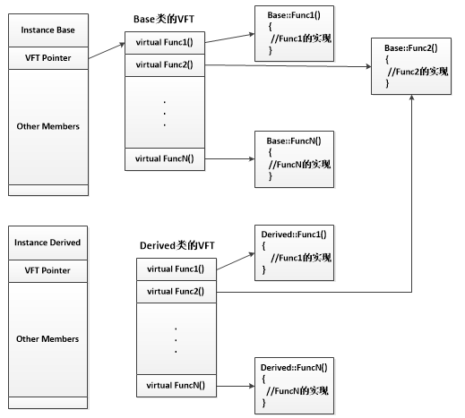

## C/C++语言
---

*   ### **new和malloc的区别，placement new, operator new？**
    - new是一种操作符(对象内默认的操作符)，malloc是一个函数
    -   new申请内存返回的类型是对象类型的指针（与对象匹配），而malloc只是单纯地被通知去申请多大的内存块它的返回是无类型指针、需要强制类型转换
    -   new和delete（操作符可重载）会调用对应的构造函数以及析构函数完成对象的创建与析构，malloc和free根据指针申请与释放内存块
    -   new具体步骤：
        -   调用operator new分配足够的内存空间
        -   调用对象的构造函数初始化
        -   构造完毕，返回该对象的类型指针
    -   malloc具体步骤：申请给定参数的内存块
---

*   ### **c++中class和struct的主要区别？**
    -   默认继承权限：class是private，struct是public
    -   默认成员函数访问权限：class是private，struct是public
---

*   ### **cout和printf区别**
    -   cout定义在iostream中的一种对象类型，printf是定义在stdio.h头文件中的一种函数
    -   cout更安全，内含大量的运算符重载，可以输出各种基本数据类型，printf需要严格定义的数据类型才可以对应输出
---

*   ### **sizeof和strlen的区别**
    -   sizeof类似于new一样也是操作符，strlen是函数
    -   sizeof的操作对象可以是变量、函数、表达式、数据类型、对象等等，而strlen的传入参数是char*指针，它主要计算字符串长度，遇到结束标识符时返回其长度。
    -   sizeof编译已经确定好要返回的大小，strlen是在运行时计算字符串长度。
---

*	### **static 静态函数、静态全局变量、静态局部变量、静态成员变量、静态成员函数**

	-	当static修饰一个函数时（**静态函数**，面向过程）
    	-	函数只可以被本文件的其余函数调用，不可以跨文件调用
    	-	其他文件有相同函数名时，不会发生冲突

	-	当static修饰一个全局变量时（**静态全局变量**，面向过程）
    	-	静态全局变量只对本文件上有效，其余文件即使用了extern也无法引用静态全局变量
    	-	与其余文件有着相同变量的全局变量不会发生冲突，多个文件可同时定义相同static变量
        -   静态全局变量放置在头文件时，每个文件include都会定义一次，会造成每个文件都有自己定义的变量，而不是全局唯一一个变量，当把static去掉，则会有multiple definition编译错误

	-	当static修饰一个局部变量时（**静态局部变量**，面向过程）
    	-	静态局部变量与静态全局变量是存储在进程的数据区(已初始化的变量存储在.data段、未初始化的变量存储在.bss段)
    	-	静态局部变量只在作用域内有效，出了作用域是无效的，但其始终驻留在数据区直到程序结束
    	-	初始化只在第一次有效，其余无效

    -   当static修饰一个成员变量时（**静态成员变量**，面向对象）
        -   这个变量是所有对象所共有的。普通变量每个对象实例都有自己的一份拷贝，而静态成员变量不是的，所有对象实例共享一份。
        -   静态成员变量同样存储在数据区，内存在初始化时才分配，静态成员变量必须初始化，而且只能在类体外进行初始化，若在类内初始化，则会导致每个对象都包含该静态成员变量，这是矛盾的。
        -   静态成员变量不需要通过某个实例访问，直接访问这个类::变量即可（公有的才可以，私有的必须通过内部的静态函数get才行）

    -   当static修饰一个成员函数时（**静态成员函数**，面向对象）
        -   静态成员函数属于类的本身，不属于任何一个实例对象，不具备this指针。**因此不能够访问非静态成员函数与非静态变量，只能访问静态成员函数与静态变量**。
        -   静态成员函数与静态成员变量一样可以通过类::函数，类::变量直接访问。
---

*	### **谈一谈volatile关键字**

	-	阻止编译器为了提高速度将一个变量缓存到寄存器内而不写回，读取某个值到寄存器操作后必须写回变量里
	-	阻止编译器调整操作volatile变量的指令顺序，即使能够阻止编译器优化，也无法阻止CPU动态调度
		-	这里可以延伸去讲singleton（如何创建单例模式的过程）
			-	new的第二和第三个过程因为CPU的动态调度被交换：
				-	分配内存
				-	调用构造函数
				-	返回内存地址地址给用户
			``` c++
			#define barrier() ___asm___ volatile ("lwsync")
			volatile T* pInst = 0;
			T* GetInstance(){
				if (pInst == NULL) {
					lock();
					if (pInst == NULL) {
						T* temp = new T;
						barrier(); // 建立水坝，cpu动态调度无法穿越这个水坝进行乱序执行
						pInst = temp;
					}
					unlock();
				}
				return pInst;
			}
			```
---

*   ### **详细说说虚函数、纯虚函数的底层实现以及应用**
    *   在声明了虚函数的类里，每个实例都会有一个虚函数指针，对应于其定义的虚函数的地址列表。子类继承含有虚函数的父类时，其也会有虚函数指针。
        *   子类也声明虚函数覆盖父类的虚函数时，编译器会根据**引用或指针**指向**对象类型**的对象寻找其要调用的函数。
        *   子类并未申明虚函数覆盖父类的虚函数时，编译器会根据**引用或指针本身的类型**寻找其要调用的函数。

        ```c++
            //举个例子
            class A {
                public:
                    virtual void func1() { cout << "A: func1" << endl; }
                    virtual void func2() { cout << "A: func2" << endl; }
                };

            class B : public A {
            public:
                virtual void func1() { cout << "B: func1" << endl; }
                //           func2() 未定义
            };

            int main(int argc, char const* argv[]) {
                A* a = new B();
                a->func1();  // 根据指针指向的对象类型即B类型调用，因此调用子类函数
                a->func2(); // 根据指针本身类型即A类型调用，因此调用父类函数
                return 0;
            }

            输出结果：
                B: func1
                A: func2
        ```
    	<div align=center>
        
		</div>

        *   从上面的图中也可以看出子类func2因为没有覆盖父类的虚函数，因此子类实例的虚函数指针指向的是父类的func2函数的地址。
        *   而子类func1覆盖了父类的虚函数，因此子类实例的虚函数指针指向了自身定义的虚函数。（多态）

    *   通过类本身变量调用函数，是不会通过虚函数指针的，而是会根据本身的类型直接调用函数。
        ``` c++
            class A {
            public:
                virtual void func1() { cout << "A: func1" << endl; }
                virtual void func2() { cout << "A: func2" << endl; }
            };

            class B : public A {
            public:
                virtual void func1() { cout << "B: func1" << endl; }
            };

            int main(int argc, char const* argv[]) {
                B b;
                A a = b;
                a.func1();    // 直接调用类型A的func1函数
                a.func2();    // 直接调用类型A的func2函数
                return 0;
            }

            输出结果：
                A: func1
                A: func2
        ```

    *   纯虚函数定义的类是一种抽象类，不能被实例化的类，无法通过new得到它的实例。
        *   纯虚函数的定义就是用来被子类具体化的，子类中的虚函数必须覆盖纯虚类，对其具体地实现。
        *   纯虚函数必须等于0，不能对这个函数进行任何定义。

        ```c++
            //举个例子
            class A {
                public:
                    virtual void func3() = 0; // 不能具体定义，需 = 0
                };

            class B : public A {
            public:
                virtual void func3() { cout << "B:func3" << endl; }
            };

            int main(int argc, char const* argv[]) {
                A* a = new B();
                a->func3();
                return 0;
            }

            输出结果：
                B: func3
        ```
---

*   ### **C语言中的memcpy与memset对class操作造成什么后果**

    *   void* memset(void* s, int ch, size_t n) 对 class 初始化时：
        *   若class内部包含虚函数，memset会将虚函数指针设置为0，若后面继承用到这个类的虚函数指针时，会使程序崩溃。
        *   若class内部包含vector<>, stack<>等STL模板类，memset会将所有的类的变量设置为0，破坏了模板类的内部结构，导致指针指向内存错误或是访问越界等情况，使得程序崩溃。

    *   void* memcpy(void* dest, const void* src, unsigned int count) 对class的复制时：
        *   若class内部包含虚函数，memcpy会将这个类的虚函数指针地址也同时复制，这种复制是有效的，因为复制类本身就要求完全相同。
        *   若class内部包含指向其他类的指针，这种拷贝是一种浅拷贝，只会复制指向这个类的指针，而不会将指向类的内存再复制一份，若需要深拷贝则需要在构造函数里在申请空间。
---

*   ### **extern "C"的作用**

    *   C++语言的函数重载是通过由编译器将函数（与参数）进行唯一的符号修饰，在链接过程中才不会发生符号冲突。
    *   C语言不存在函数重载，因此不存在符号的修饰。直接通过C++调用C语言的函数时会存在链接错误的问题，寻找不到这个函数的错误。
    *   extern "C"就是用来解决这种不兼容问题，extern "C" 包裹的代码块内的所有变量以及函数，不会被g++编译器进行符号修饰，而依旧用原来的gcc编译的方法进行符号修饰。
    *   但是C语言不兼容extern "C"，所以函数无法同时被C和C++都使用，此时可在头文件将函数声明为，因C++编译器会在编译c++程序时默认定义宏__cplusplus：
        ```c++
        #ifdef __cplusplus
        extern "C"{
        #endif

        void func();

        #ifdef __cplusplus
        }
        #endif
        ```
    *   符号修饰是为了使不同的代码语言例如汇编以及C语言产生的目标文件能够正常使用定义的符号，各自语言的符号修饰使得定义的变量与函数不会互相冲突。
---

*   ### **强符号与弱符号，强引用与弱引用**

    *   强符号与弱符号：
        -   强符号：编译器默认函数与初始化了的全局变量
        -   弱符号：未初始化的全局变量
        -   规则：
            -   不允许强符号被多次定义，例如多个文件中同时定义相同的初始化的全局变量。
            -   若一个文件中的某个符号为强符号（初始化），其余文件中的相同符号为弱符号（未初始化），编译器会选择强符号进行链接。
            -   所有文件都是弱符号，选择占用空间最大的一个。例如某个符号有 int 与 double，那么编译器会选择double。（不要使用！）

    *   强引用与弱引用：
        -   强引用：外部符号引用需要被正确决议，如果无法找到这个符号，则链接器报错
        -   弱引用：外部符号引用无需立刻被决议，若有定义，则正确决议，若无定义，链接器不报错，但运行时还未被决议（反汇编的函数与变量地址全为0），则运行时报错。

    *   弱引用与弱符号主要用于库的链接过程
        -   库中定义的弱符号可以被用户定义的强符号覆盖，例如printf
        -   将定义的外部引用定义为弱引用，编译通过，当将外部模块与程序链接时，程序得以正常运行，外部模块也可以随时切换（松耦合）
---

*   ### **右值和左值的概念**

    * 左值指既能够出现在等号左边，也能出现在等号右边的变量（赋值与被赋值）。
    * 右值则是只能出现在等号右边的变量（赋值）。
    * 左值一般有变量名字，通过变量的名字能够索引到相应的内存块。
    * 右值一般指临时变量，这些临时变量是编译器自动产生的，无法在代码中直接地通过变量名索引内存块。
    * 左值和右值主要的区别之一是左值可以被修改，而右值不能。

    **右值和左值示例如下**：
    ```c++
    int a; // a 为左值
    a = 3; // 3 为右值
    ```
---

*   ### **右值引用和左值引用的概念**

    * 左值引用：必须引用一个对象，以前在C++使用的T&（引用）一般就是C++11就被称为左值引用。
    * 右值引用：就是必须绑定到右值的引用，C++11中右值引用可以实现“移动语义”，通过 && 获得右值引用。

    **右值引用和左值引用示例如下**：
    ```C++
    int x = 3;
    int& y = x; // ok，y为左值引用，绑定在对象x上。

    int& a = x * 6; // 错误，x*6是一个右值，不能够通过左值引用修改右值，违背语义
    const int& b =  x * 6; // 正确，可以将一个const引用绑定到一个右值，这样便无法通过左值引用修改右值，合法！

    int&& q = 3; // ok，q为右值引用，可以绑定在右值上
    int&& w = x; // 错误，x是一个左值
    ```
    在上面的例中，可以看到const左值引用能够引用右值。那么能否有右值引用能够引用左值呢？ std::move，std::forward就是为了做这类事情而诞生的。
---

*   ### **std::move的作用**

    * https://zhuanlan.zhihu.com/p/335994370, 可以参考～！
    * std::move本质不会移动任何东西，做的事情只有**强制类型转换**，将左/右值都转换为右值引用。
    * 单纯的std::move(xxx)不会有任何的性能提升，必须配合**移动语义**以避免在某些情况产生的拷贝。
    * 形参使用 左值引用（T&&）或者 右值引用（T&）都能够避免传参数时的拷贝，性能是一样的。
    * 右值引用可以直接指向右值，也可以通过std::move指向左值；而左值引用只能指向左值(const左值引用也能指向右值，但不能够通过左值引用修改右值)。
    * 真正能够避免拷贝的过程是由**移动构造函数**、**移动复制构造函数**、**移动赋值运算符重载函数**的实现决定的，举一个例子：
        ```c++
        class A {
        private:
            std::string _data;

        public:
            // 一般构造函数，主要针对左值引用（形参）与左值（实参），传参过程无拷贝
            // ！！注意！！ data形参本身是左值，能够放在等号左边
            explicit A(const std::string &data) {
                std::cout << "genernal construct" << std::endl;
                _data = data;  // 会产生std::string临时变量的一次拷贝
            };

            // 移动构造函数，主要针对右值引用（形参）与右值（实参），传参过程无拷贝
            // ！！注意！！ data形参本身也是左值，能够放在等号左边
            explicit A(const std::string &&data) {
                std::cout << "move construct" << std::endl;
                // 这里必须调用std::move，将左值转成右值引用，否则无法调用移动复制构造函数
                // 是否产生拷贝取决于std::string的移动复制构造函数实现
                _data = std::move(data); 
            };
        };
        ``` 
    * 一般STL的各类容器都会内置实现**移动构造函数**、**移动复制构造函数**、**移动赋值运算符重载函数**，因此能够使用右值引用的方式则尽可能使用，能够提升一定的性能
---

*   ### **std::move和std::forward**
    * std::forward功能比std::move更强大，std::move只能够转换出右值引用。
    * std::forward能够自动区分传递的实参是左值还是右值，根据不同的值类型，作出完美的转发。
---

*   ### **拷贝（复制）构造函数**

    * 传递类本身的参数时必须是引用类型：```A (const A& a)```
    * 传值，将引起拷贝过程，无限循环调用拷贝构造函数，因此编译器会直接禁用：```A (const A a)```
---

*   ### **赋值运算符重载函数**
    * 必须返回类的引用类型：```A& A::operator= (const A& other)```，只有返回引用类型，才可以有连等的表达式：```A = B = C```。
    * 必须判断参数other是否为本身，是的话应该直接返回，不做任何变更（边界条件）。
    * 申请内存时，应先用临时变量申请，后变更自身的状态，否则内存不足时抛异常，类实例状态不一致，容易导致程序崩溃。

