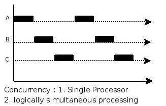
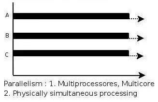
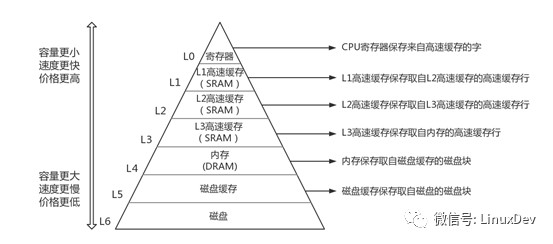
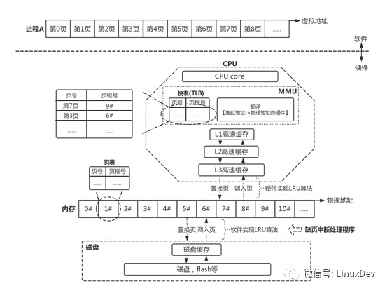

## 操作系统
---

*   **进程间通信方式：**
    -   无名管道：有血缘关系的进程中使用，通常是父子关系。
    -   有名管道：任意进程中都可以用有名管道通信。
    -   消息队列：消息队列的话可以被认为是一个消息链表。某个进程放置消息，其余进程可以根据需求去读取消息。管道得先有读取者，写入才有意义，消息队列不需要这样。
    -   信号量、互斥量、读写锁等同步手段：应该是与线程类似的锁机制。
    -   共享内存（回答的时候可以深入这一块讲）：是IPC（interprocess communication, 进程间通信）形式中最快的，不需要执行内核的系统调用来传递数据。假设在文件复制过程中，利用管道、FIFO、消息列队进行进程间通信时，我们总共是需要4个系统调用，包含了文件到某个进程、进程到管道、FIFO、消息列队，管道、FIFO、消息列队到另外一个进程，另外一个进程到文件，四次数据复制过程，比较耗时，共享内存区只需在进程中控制文件读取到共享内存区，再由另外一个进程将共享内存区的数据复制到输出文件即可，总共2次系统调用。
    -   套接字：TCP与UDP这些。
---

*   **线程间通信方式：**
    -   线程间通信主要是为了线程同步，没有数据交换的通信机制。线程并发执行，能够共享进程中共享内存区，例如堆数据、全局变量等
    -   线程安全机制：
        -   锁机制。线程访问资源前必须获得其锁，若是锁已经被占有则需要等待，线程访问结束后释放锁。
        -   信号量。锁机制一种，分二元与多元信号量，多元信号量n，每个线程访问时将信号量-1，当n等于0时则等待，二元信号量则是n=1;
        -   互斥量。比信号量更严格，某个线程获取信号量后必须由它自身释放，其余线程释放无效。
        -   临界区。比互斥量更严格，临界区内的资源只允许本进程去试图访问，其余进程不允许。
        -   读写锁。是为了在读的情况下允许高并发访问，写的情况下执行锁机制，锁状态包含自由、共享、独占，要想独占得等到锁自由才可以。
---

*   **死锁（互相等待对方的资源）的四个必要条件**
    -   互斥：一个资源每次只能被一个进程所持有
    -   占有且等待：进程因请求资源阻塞时不会释放自己已持有资源
    -   不可强行占有：不可强行剥夺进程占有资源，除非进程已停止释放了资源
    -   循环等待：若干多个进程形成头尾相接的等待资源关系
        -   银行家算法能够有效地避免死锁：
            -   银行家算法是操作系统通过维护4个表，判断能够给予进程资源，让进程运行的依据。
            -   allocation：进程已持有资源
            -   max：进程需要的最大资源
            -   available：目前操作系统所剩余资源（可被获得资源）
            -   need：max-allocation，进程还需要多少资源才能继续运行
            -   实际上就是维护两个表need, available，need小于available则赋予其运行权利。
---

*   **进程、线程的状态**
    -   线程：就绪（可以立马运行，但没有CPU时间片）、等待（等待资源释放）、运行
    -   进程：
        -   R（可执行状态）
        -   S（可中断睡眠状态，等待唤醒）
        -   D（不可中断睡眠状态），例如执行vfork系统调用后，父进程将进入TASK_UNINTERRUPTIBLE状态，直到子进程调用exit或exec
        -   T（暂停或者跟踪状态）
        -   Z（僵尸进程、僵死状态，留下空壳（包含退出信息）给父进程查阅
        -   X（退出状态、进程即将销毁）
---

*   **谈一谈并发与并行的区别**
	
	

	  
	
    

	
	-	并发：
		-	在单个CPU以及同个机器的情况下，多个进程看似同时进行，实则是CPU为每个进程合理地分配CPU时间片，在进程之间来回切换。
		-	进程的并发是互相抢占CPU资源的
		-	多个进程在一个**时间段**上同时执行
		-	并发通常是指在同个机器下以及单个CPU的情况
	
	-	并行：
		-	在多个CPU（或者是多核）情况下，一个CPU执行一个进程时，另一个CPU可以执行另一个进程。
		-	进程不互相抢占CPU资源，可以同时进行。
		-	多个进程在一个时间点上同时执行
		-	并行必须得有多个CPU（多核）情况

---
	
*   **谈一谈同步与异步的区别**
	-	不会

---

*	**虚拟内存到映射到物理内存机制，MMU硬件模块，CPU的TLB, L1, L2, L3高速缓存作用**

	*	金字塔模型，经典存储结构图，下图表示的都是硬件模块：

	

	  
    

	*	金字塔从下到上，容量越小，价格越高，速度越快。上层数据来自下层，下层不存在的数据，上层不可能拥有。

	*	虚拟内存与物理内存核心观念：
		-	程序访问到的地址为虚拟地址，实际的主存上的地址叫做物理地址，虚拟地址是从逻辑上对内存的扩充（内存昂贵）。
		-	CPU访问虚拟地址，MMU（Memory Management Unit）内存管理单元（硬件模块）把虚拟地址转换为物理地址，CPU再通过得到的物理地址访存。
		-	对每个进程来说，认为自己可以拥有4G内存（32位操作系统），而物理内存只有2G，实际上是操作系统通过缺页中断方式置换物理内存页。

	*	下图就是CPU寻找页面的过程：

		

		  
		

		-	从软件层面上看进程，假设在32位操作系统中，每页大小为4K，那么对于每个进程来说，它应拥有 $4G/4K=1M(2^{20} = 1048576)$ 数量的页，当进程需要时，操作系统就得想方设法得给予。

		-	当CPU需要获取某个虚拟地址所指向的数据时
			-	【获取步骤】将虚拟地址发送给MMU，MMU访问内存的页表，获取物理地址，并将其返还CPU
			-	【查询步骤】 CPU根据物理地址获取真实数据
			
			内存访问速度远远比不上CPU速度，因此CPU在等待内存访问的过程花费许多时间。为了提高获取数据的速度，因而有了TLB快表（Translation Lookaside Buffer，转移后被缓冲区），内置于MMU中的硬件模块，用于记录页表中频繁使用的页表项，同时，在CPU中还有内置的L1, L2, L3高速缓存，这些高速缓存也能够缓存频繁使用的页表项，越靠近CPU的缓存速度越快，有了快表以及高速缓存能够避免每次都去访问内存中的页表获取物理地址。

		-	有了TLB以及高速缓存后后，当CPU需要获取某个虚拟地址所指向的数据时，其【获取步骤】变成：
			-	将虚拟地址发送给MMU，MMU查询快表
				-	命中则直接返回物理地址给CPU
				-	未命中则访问高速缓存中是否存在需要的页表项
					-	命中（应该是指存在位为1）则更新快表，并进入【查询步骤】
					-	未命中则查询内存中的页表，内存中总能查询到页表项
			-	将查询的页表项记录（或更新）到高速缓存
			-	MMU从高速缓存获取页表项，根据页表项中存在位，判断内存中是否存在物理页
				-	存在则进入【查询步骤】
				-	不存在触发【缺页中断】
			-	【缺页中断】程序（软件层面）：
				-	LRU算法为虚拟页分配物理页框
				-	更新内存中页表，设置对应的物理页框号
				-	修改寄存器指令，重新运行【获取步骤】
			-	【查询步骤】：
				-	MMU获取物理地址后，根据物理地址查询高速缓存
					-	命中，CPU直接从高速缓存拿数据
					-	未命中：
						-	根据物理地址查询物理内存
						-	硬件实现将数据页记录到高速缓存
						-	CPU再从高速缓存拿数据
---

-	**为什么都说进程切换开销大**

	-	进程上下文切换过程主要有两个：
		-	保存过程：CPU需要将各个寄存器保存在进程私有堆栈中，并将私有堆栈指针保存在进程控制块。
		-	恢复过程：从进程块中取出保存的堆栈指针，然后根据这些指针获取保存的寄存器。

	-	进程切换花销主要包含两块花销：
		-	CPU寄存器需要保存和加载，操作系统还需要执行调度器的代码切换进程。
		-	TLB和高速缓存Cache中由于进程切换，部分页表以及缓存被刷掉，导致命中率下降，前期会触发大量的缺页中断。

---

-	**静态链接与动态链接的区别**

	-	静态链接
		-	在链接过程就将所需要的所有函数二进制代码包含到可执行文件中
		-	可执行文件较大，浪费较多的磁盘空间，多个可执行文件可能包含有多个相同的副本
		-	浪费内存空间，当多个程序同时运行时，由于每个可执行文件都有多个副本，因此在内存中也会存在多个副本。
	-	动态链接
		-	动态链接将链接过程推迟到运行时链接。
		-	运行某个程序文件时，若缺少了某个函数，动态连接器则会将这个所需要的.so文件加载到内存中，然后映射到对应的进程空间，并且对那些未决议的符号进行重定位工作。对于另外一个程序来说，若也需要.so文件，此时只需要进行链接，而不需要再次加载文件进内存。好处在于：
			-	节省内存空间
			-	节省磁盘空间
			-	增加CPU缓存命中率
			-	使得开发的模块独立性更强，耦合度小，模块间独立开发。
