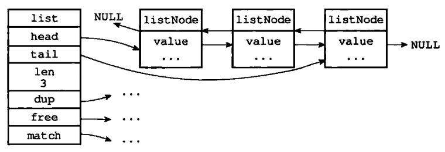
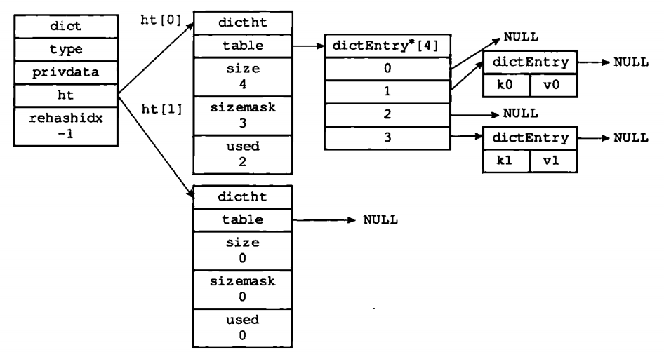
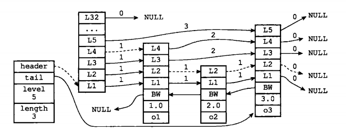
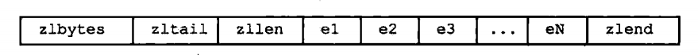
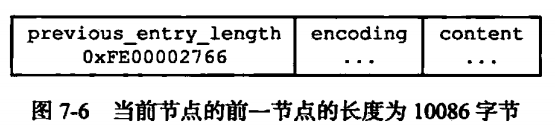
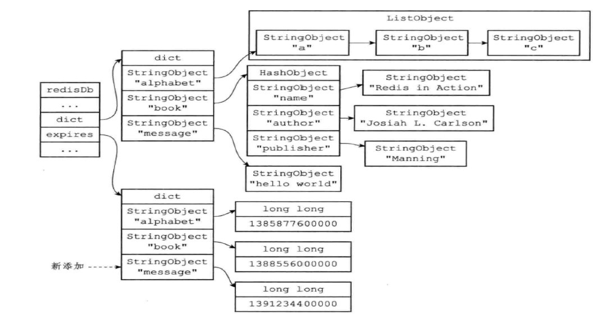
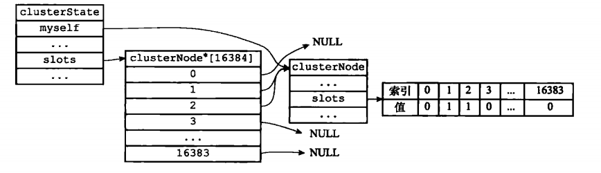
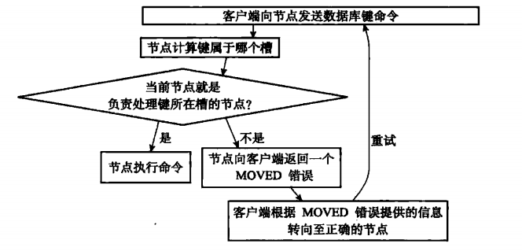
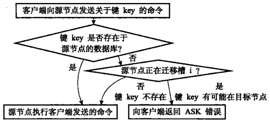

### 数据库
---

*   ### **数据库事务的属性（ACID）**
    -   Atomicity原子性：要么执行要么不执行
    -   Consistent一致性：数据库状态转换必须保持一致。300+300->400+200
    -   Isolation隔离性：事务之间不会相互影响。
    -   Durability持久性：事务提交成功，则永久保存在数据库内。
---

*   ### **说一下Redis的优劣势**
    -   优点：
        -   高速缓存，Redis读的速度能高达10万/s，写的速度能高达8万/s
        -   丰富的数据类型，支持string字符串、list列表、set集合、sorted set有序集合、hash哈希五类对象
            -   Redis的string与C语言里设计的字符串较为不同，Redis字符串是一个结构体，其包裹着三个变量，两个int（free、len）、一个char[]（buf）。
            -   列表对象一般底层实现是压缩列表，压缩列表是为了节约内存而开发出来的，它能够节约内存在于它是连续内存块组成的结构，减少内存碎片的产生，每一块内存都保存着例如是它的实体，长度，尾节点偏移量等等。列表还有另外一种底层实现：链表，与我们平常所用的双向链表没有太大的不同，特别的就是它会用一个大的结构体持有整个链表，因此可以非常迅速地找到头节点与尾节点，它的节点值是void*类型，保证了多态性。
            -   有序集合对象与哈希对象可以联合一起来说，有序集合对象在底层实现的时候一般采用字典与跳跃表联合的方式，字典作用在于：保存键与权重，O(1)获得对应键的权重，跳跃表作用则在于范围型查找，通过一种跳跃节点形式加速范围型查找，是因为每个节点都保存了一个level结构体数组，结构体数组里面包含了一个跨度与前进指针，通过跨度的判断就能够知道跳跃了多少个节点。
        -   支持对数据的持久化
            -   AOF与RDB是Redis持久化的两种手段，他们存储手段各有其特点
                -   RDB (Redis DataBase)：数据库存储快照（压缩的）
                    -   SAVE与BGSAVE命令都是保存数据库快照的命令了，他们不同的地方在于一个是在主进程上执行，一个是fork()后执行。
                    -   RDB存储下来的文件是以Redis设置的协议格式存储键值对，是为了在数据库加载rdb文件时快速执行
                    -   RDB是一种自动性间隔保存，调用的是BGSAVE，它不好的地方就在于如果在两次存储之间服务器宕机了，则会丢失这段时间的数据
                -   AOF（Append Only File）：
                    -   通过执行的写命令来记录数据库状态的
                    -   AOF的效率可以达到每秒更新一个AOF文件，因此即使出现故障停机，也只会丢失一秒钟内的数据
                    -   AOF一个坏处就是记录写的命令会导致这个非常地大，AOF重写文件机制可以改善这个坏处
                    -   AOF加载过程实际上是模拟一个客户端访问数据库，不停执行保存在文件的命令。
        -   Redis也支持事务，符合ACID原则

    -   缺点：
        -   AOF与RDB持久化在服务器重启过程的加载时间会比较久，而在这个过程中，redis是不能提供服务的
        -   redis是内存数据库，内存价格太过昂贵，因此在成本考虑优先地情况下，因此必须预机器内存是否足够，否则是有可能造成数据丢失。
        -   主从同步过程中，完整重同步需要生成RDB文件并传输给slave，此时会占用主机的大量CPU，有可能对redis提供服务造成一定的影响。
---


*   ### **Redis写RDB的主要过程是怎样的？**

    <div align=center>
	
    </div>

    *   客户发送BGSAVE命令请求
    *   主进程判断当前是否可以允许进行RDB的快照存储
    *   不可以则直接返回，可以则fork()（阻塞）创建子进程后调用rdbsave()
    *   子进程被创建则返回创建成功信息给父进程，父进程则继续处理其他请求
    *   子进程创建临时快照文件成功后，替换原来的RDB文件
    *   子进程返回信息给父进程，父进程更新信息（dirty、lastsave）
---

*   ### **Redis的简单动态字符串（Simple dynamic string, SDS）**

    * Redis中经常要用到字符串，比如我们设置的键与值：set msg "Hello World"，这些键与值都需要保存下来，那么Redis就利用字符串结构体保存这些字符串。

    *   Redis并没有用传统的**C语言字符串**来表示（以空字符结尾的字符数组，C字符串），而是构建了自己的**动态字符串结构体SDS** ：
        ``` c
            // 需要注意的是，len + free = 申请的空间
            struct sdshrd {
                // 记录已申请空间中已使用的长度
                int len;
                // 记录已申请空间中未使用的长度
                int free;
                // 字符数组，保存数据
                char buf[];
            }
        ```
    *   Redis使用构建的动态字符串对比与传统C语言所产生的好处在于：
        *   常数复杂度获取字符串的长度，C字符串主要是遍历遇到空字符则返回其长度O(n)，而Redis可以直接访问SDS的**len**就可以获取其长度O(1)。
        *   解决缓冲区溢出问题，C语言中许多字符串操作都是需要预先分配好空间的，如果执行字符串操作函数，例如执行 char* strcat(char *dest, cons char *src) 时，没有对dest提前赋予足够的空间，则会**造成dest数据溢出到保存在它（内存位置）后面的数据（覆盖）**，导致别的数据被污染。而SDS的空间分配（空间预分配）策略杜绝这种情况，会检查是否有足够（检查free的大小）的空间去容纳字符串，避免这个问题。
        *   空间预分配策略与惰性空间释放减少修改字符串时带来的内存重分配（系统调用）次数：
            *   空间预分配：
                *   分配后小于1MB，则使len=free，分配多一倍。
                *   分配后大于1MB，则多分配1MB。
            *   惰性空间删除：
                *   不立即删除空间（不马上free），而是利用结构体的int free记录下来，以后可能会用到，避免再分配。
        *   SDS本身不存在以空字符结尾则保证了二进制安全性，SDS通过len来判断字符串长度的，不以'\0'来判断，所以在存储的 char buf[] 中含有'\0'或是其他字符都是可以的。
        *   兼容部分C字符串函数，strcasecmp(sds->buf, "hello world")，只要SDS遵循C字符串以空字符结尾这一个规则。
---

*   ### **Redis数据类型总结**

    *   Redis中丰富的数据类型，以及其高速的缓存机制（利用将数据保存在内存中），使得越来越多的人利用Redis做数据存储。那么它的丰富数据类型主要包含了以下几个：

        *   简单的动态字符串(SDS)
            *   **字符串**是Redis的核心字符串，串通了整个开源框架，几乎所有需要用到字符串的地方都需要SDS。

        *   链表
            <div align=center>
            
            </div>

            *   结构体中prev以及next指针，分别指向上一个节点以及下一个节点，还包含了当前的结构体所要包含的void\*指针（多态），
            *   list结构持有整个链表，list中包含了链表头节点地址，链表尾结点地址，链表长度，许多操作时间复杂度为O(1)

        *   字典
            <div align=center>
            
            </div>

            -   字典由哈希表 dicht 以及哈希表节点 dictEntry 
            -   哈希表 dicht 持有 dictEntry** table，dictEntry** table为二级指针主要为了存储（索引-键-值）。
            -   一级指针指向了哈希索引（桶表），索引值会造成哈希冲突，解决哈希冲突最经典的办法则是拉链法，而Redis也是使用拉链法解决哈希冲突的，图中每个dictEntry实体含有next指针。
            *   字典 dict 持有整个哈希表，实际是持有两个哈希表 dictht ht[2]，一般数据库操作会在哈希表 ht[0] 进行，而在 rehash 过程中，哈希表 ht[1] 才会发挥作用。
            -   rehash 是因为负载因子 ( factor = used / size) 过高/过小的原因，过高会造成哈希表某一个索引上聚集大量的冲突，查询速度变慢，过小则是会过于浪费内存空间需要释放。
            *   rehash 的过程是渐进式的，因为如果 hash 表中的键值对保存了大量的数据，此时如果一次性 rehash 必然会造成服务的暂停，为了确保服务不会被长时间地停止，因此采用渐进式 rehash，rehashindx 则记录了hash过程，-1表示目前没有进行rehash。

        *   跳跃表
            <div align=center>
            
            </div>

            *   跳跃表在Redis只用了两次，一个是实现有序集合的键，另一个是在集群节点中用来将键与槽号关联，槽号作为分值，方便快速搜索整个槽的所有键。
            *   跳跃表（zskiplist）保存了 header, tail, level, length等属性
            *   header 定义为 struct zskiplistNode 实际上与中间的所有 node 是同个定义，只是表头不会用到后退指针、分值和对象等属性。
            ```c++
            struct zkiplistNode{
                // 后退指针
                struct zkiplistNode *backward;
                // 分值
                double score;
                // 成员对象，多态
                robj *obj;
                // 层
                struct zskiplistLevel{
                    // 前进指针
                    struct zkiplistNode *forward;
                    // 跨度
                    unsigned int span;
                } level[];
            }
            ```
            *   struct zskiplistNode 中的 struct zskiplistLevel 结构体被定义为 level[] 数组。每个 level 包含了forward指针以及其forward的跨度，每添加一个节点的时候，会随机初始化这个level的层数（1-32，不含0是因为至少有一层，不然会跳跃表会中断），表头节点总共32层不进行随机初始化。
            *   跳跃表对连续访问友好，只需要从高处往低处寻找跨度为1的forward指针即可连续遍历这个跳跃表，节点头也包含了头节点以及尾节点的指针，通过这个指针能快速访问头尾节点。
            *   跳跃表还包含了后退指针，后退指针并无跳跃性所言，跨度始终为1，这只是为了从尾到头的遍历需求。

        *   整数集合
            *   整数集合是集合键的底层实现之一，当一个集合只包含整数值元素，并且这个集合的元素数量不多时，Redis就会使用整数集合作为集合键的底层实现，其实这个整数集合，完全是一个没有优化过的整数数组（我认为）。
            *   整数集合结构体简单的包含了三个部分：encoding, length, contents[]。编码方式的存在使得整数集合会有升级的状况出现，当content[] 包含了不同类型的整数时，以需要最多位数的为主。整数集合不支持降级操作。

        *   压缩列表

            <div align=center>
            
            </div>

            *   压缩列表 ziplist 也可以作为哈希键或者列表键的底层实现。适用于整数值较小，以及字符串长度较小的的键，利用压缩列表可以有效地节省内存使用，因为压缩列表是一段连续的内存块组成的顺序型数据结构。

            *   压缩列表要包含五个模块：zlbytes（记录整个压缩列表占用的内存字节数）、zltail（记录压缩列表表尾距离压缩列表起始位置的距离字节）、zllen（记录压缩列表的节点数）、entry（压缩列表节点）zlend（0xff标志结尾），每个entry如下图：

            <div align=center>
            
            </div>

            *   每一个压缩列表节点entry包含了三个部分：previous_entry_length（可以用来从后往前访问这个压缩列表、其字节长度跟随内容变化、引起连锁更新的主要原因）、encoding（编码方式，类型在前长度在后），00 01 10表示 1 2 5字节（这个字节长度表示的是encoding的长度）长度的数组编码，11表示 1 字节长的整数编码，contents数组的长度在encoding除去最高两位的后面所有位数表示。
---

*   ### **Redis数据库键过期的底层实现**
    -   Redis服务器将所有数据都保存在 redisServer 结构体中的 db 数组

        ```c++
        struct redisServer{
            ...
            // 结构体数组，保存所有数据库 -> db[0], db[1], ..., db[15]
            redisDb *db; 
            // 数据库数量，默认16，可配置
            int dbnum;
            ...
        };
        ```
        -   redisClient 通过切换 db 指向不同的数据库进行访问
        -   对于其中的 redisDb *db 其定义为：
            ```c++
            typedef struct redisDb{
                ...
                // 数据库的键空间，保存所有的键值对
                dict *dict;
                // 保存数据库中所有设置了过期时间的键值对，
                // 节约内存，共享上面 dict 中的类型对象
                dict *expires;
                ...
            } redisDb;
            ```
            其中 dict 与 expires 持有的键值对如图所示：
            
            <div align=center>
            
            </div>

            使用 EXPIRE/PEXPIRE/EXPIREAT/PEXPIREAT 设置某个键的过期时间时，其底层实际是设置某个键对象中的 long long 类型的整数，是UNIX的时间戳。从这个变量可以判断键是否过期。
    
---

*   ### **Redis数据库过期键删除策略**

    -   **一般三种不同的删除策略**：
        -   定时删除：设置键的同时，设置定时器，让定时器在键过期时刻执行键的删除操作。（主动）
        -   惰性删除：由客户获取键的同时，对键查询是否过期，如果过期就删除这个键，没过期则返回。（被动，可能导致内存爆满，某个键过期后不被访问则不会被删除，依旧占用内存）
        -   定期删除：每隔一段时间，利用服务器周期性操作对数据库进行检查。检查的数据库以及键值量由算法决定。（主动，CPU与内存的折中方式）

    -   各自缺陷：
        -   定时删除：CPU占用量大，影响服务响应时间和吞吐量。并且执行服务需要用到时间事件，其数据结构为无序链表，查找某个特定定时器为O(N)。
        -   惰性删除：某个键若过期，但没有被访问过，则一直占用内存，不被释放，造成内存泄漏现象。
        -   定期删除：前两种方案的折中
            -   每隔一段时间进行定期删除，限制时长和频率，从而限制对CPU的影响
            -   定期删除过期键能够一定程度避免内存浪费现象
    
    -   **Redis的过期删除策略**：
        -   惰性删除 + 定期删除相结合，在CPU与内存之间取得平衡。
        -   惰性删除策略底层实现：
            -   所有读写数据库的操作，会在命令执行之前执行过期检查 - expireIfNeed
                -   过期 expireIfNeed 则执行删除操作
                -   不过期，跳过 expireIfNeed
        -   定期删除策略底层实现：
            -   Redis定制的周期性函数 serverCron 执行调用 activeExpireCycle函数
            -   activeExpireCycle 函数分多次遍历数据库，从中随机检查一定数量的键（数量可配置）的过期时间，过期则执行删除操作
            -   设置全局变量记录遍历过的数据库编号，下次函数执行时从全局变量记录的编号开始，这种机制保证每个数据库都会被检查

        -   Redis还可以设置了内存淘汰机制：
            -   服务器打开了 maxmemory 选项的话，并且算法为 volatile-lru 以及 allkeys-lru 的话，当服务器超过设置的内存占用时，服务器会执行内存回收函数，空转时长较长的键会被优先释放
            -   volatile-lru 只针对数据库中设置了过期时间的键
            -   allkeys-lru 针对数据库中所有的键
---

-   **Redis的主从复制功能**

    -   完整重同步主要用于初次复制：
        -   同步：
            -   从节点发送PSYNC命令给主节点
            -   主节点调用BGSAVE命令，后台生成RDB文件，同时使用缓冲区记录现在开始的写命令
            -   当RDB文件成功生成后，主节点将文件发送给从节点，从节点利用RDB文件更新数据库状态
            -   主节点将缓冲区的写命令发送给从节点，从节点更新数据库与主节点保持一致
        -   命令传播：
            -   每当主节点的状态变化时，将写命令发送给从节点，使状态保持一致

    -   部分重同步主要处理断线后重复制：
        -   复制偏移量：
            -   主从节点分别维护自己的复制偏移量
            -   主节点发送了多少字节，从节点收到了多少字节，就往自己的复制偏移量上加
            -   通过这个值，可以判断主从是否一致
        -   复制积压缓冲区（固定长度的FIFO）：
            -   将所有的写指令缓存在FIFO中，当大小不足时直接剔除
            -   某个节点断线后重连，发送自己复制偏移量给主节点时，主节点根据偏移量是否存在FIFO决定进行完整重同步还是部分重同步
                -   如果FIFO中还存在着偏移量所指的写指令，则进行部分重同步
                -   如果FIFO中已经不存在着偏移量所指的写指令（断线过久），则进行完整重同步
            -   FIFO的大小建议：断线平均时间 X 每秒写入量
        -   心跳检测，从节点默认每秒一次频率，向主服务器发送命令：
            -   检测主从服务器网络连接状态
            -   辅助实现min-slaves选项
            -   检测命令丢失（丢包情况，从FIFO取出并发送给从节点）

---

-   **Redis的事件设计**
    
    Redis服务器是一个事件驱动程序，服务器主要处理以下两类事件：
    -   文件事件：套接字与客户端的连接，文件事件就是服务器对套接字操作的抽象。服务端与客户端通信产生文件事件，根据文件事件类型调度事件处理器，对应处理相应的事件。

    -   时间事件：服务器中一些操作，例如serverCron函数需要定期的执行，时间事件就是指这类操作。

---

-   **Redis集群的数据结构**

    集群中的节点会继续使用单机节点服务器组件，会继续使用 redisServer 结构体来保存服务器状态，但对于集群中的节点来说，其集群模式下用到的数据，节点会将它们保存到 clusterNode, clusterLink, clusterState 结构体中。

    -   clusterNode 主要保存节点的各种状态值，集群中每个节点都创建这个结构体保存状态：
        ```c++
        struct clusterNode{
            // 创建时间
            mstime_t ctime;
            // 标志，例如角色（主从）、状态（在线下线）
            int flags;
            // 节点当前的配置纪元，用于故障转移
            uint64_t configEpoch;
            // Ip地址
            char ip[REDIS_IP_STR_LEN]
            // 端口
            int port;
            // 保存连接节点的相关信息
            clusterLink *link;
            // 节点所负责的槽位, 以每一个bit(0/1)来表示是否负责这个槽
            unsigned char slots[16384/8];
            // 负责的槽总数量
            int numSlots;
            ...
        };
        ```
    -   每个节点的 clusterNode 里面有着它连接集群的信息 clusterLink 结构体，包含了比如套接字、输入缓冲区、输出缓冲区等：
        ```c++
        struct clusterLink{
            // 创建时间
            mstime_t ctime;
            // TCP 套接字描述符
            int fd;
            // 输出缓冲区，保存发送给其他节点的信息
            sds sndbuf;
            // 输入缓冲区，保存着从其他节点接收到的信息
            sds rcvbuf;
            // 与这个连接相关联的节点，如果没有的话为 NULL
            struct clusterNode *node;
            ...
        } clusterLink;
        ```
    -   每个节点保存一个 clusterState 结构，记录在当前节点的视角下，集群目前所处的状态：
        ```c++
        struct clusterState{
            // 指向当前的节点
            clusterNode *myself;
            // 集群当前的配置纪元，用于故障转移
            uint64_t currentEpoch;
            // 集群当前的状态：在线还是下线
            int state;
            // 集群中处理着某些slots的节点数量
            int size;
            // 集群节点名单
            // 字典键为节点名字，值为clusterNode结构体指针
            dict *nodes;
            // 每个槽的负责节点，利用指针O(1)指向就能获得节点
            clusterNode *slots[16384];
            ...
        } clusterState;
        ```
    -   槽指派过程，从数据结构可以看出，slots数组对每个槽都指向了具体对应的clusterNode，如果这个槽不被某个节点负责，则为NULL。
            <div align=center>
            
            </div>

        上图描述了将槽0 1 2指派给当前节点的过程，建立的两个slots有两个好处：
        -   对集群的clusterState来说，能够O(1)访问某个槽所负责的节点
        -   对于节点clusterNode来说，能够以O(N)的方式获取负责的所有槽位置
    
    -   MOVED 错误，当客户端请求命令的键值不属于自身负责的槽时，会向客户端返回 MOVED 错误，过程：
            <div align=center>
            
            </div>
        -   被访问的节点计算出键所属的槽 i 之后，节点检查自己的clusterState.slots[i]
        -   如果clusterState.slots[i] == clusterState.myself，则为自己负责，节点执行客户端的命令
        -   如果clusterState.slots[i] != clusterState.myself，则通过clusterState.slots[i]找到对应的clusterNode，取得其ip以及port返回给客户端MOVED错误，指引其转向。
        -   单机模式下，客户端不识别MOVED错误，只会直接打印错误，而集群模式下，客户端根据错误自动进行节点转向，并打印出转向信息，同时执行命令。

    -   ASK 错误，在**重新分片**期间，源节点想目标节点迁移一个槽的过程中，某个键可能已经存在目标节点上时，会向客户端返回 ASK 错误。
            <div align=center>
            
            </div>
---

-   **Redis集群的故障检测与转移**
    -   故障检测：
        -   集群某个A主节点定期向其他主节点发送PING，若设定时间不返回PONG，则将不返回PONG的X主节点标记为疑似下线节点，并通过消息方式告知其他主节点，X主节点已被A节点标记为疑似下线。
        -   消息被其他节点接收后，其他节点会在自己的clusterState中找到X节点的clusterNode并将其下线报告fail_reports更新。
        ```c++
        struct clusterNode{
            ...
            list *fail_reports;
            ...
        }
        ```
        -   从A主节点去看clusterState，当list链表长度大于集群数量一半时（不包含过期的下线报告），X主节点则被标记为下线，A节点立马向集群广播，所有收到消息的主节点将X节点标记为下线状态。

    -   故障转移：
        -   复制X主节点的从节点中，会有一个从节点被选中（下个问题选举方式）。
        -   新的从节点slaveof no one，成为新的主节点。
        -   新的主节点撤销X节点的所有槽指派，将所有槽指派指向自己。
        -   新的主节点广播消息。
        -   集群重新上线，新的主节点接收自己负责槽的有关命令，故障转移完成。
---

-   **Redis集群新主节点选举方式**
    -   集群的配置纪元是一个自增计数器，初始为 0
    -   X主节点的从节点发现X主节点下线，从节点向集群广播一条消息，要求收到的主节点投票给这个从节点。每个主节点在一个纪元内只能投一次票。先收到谁的投票请求就投给谁（发回消息给从节点）。
    -   从节点根据收到的返回消息统计自己获得多少节点支持，票数超过半数时，则成为主节点（超过半数的从节点只会有一个，因此新的主节点也只会有一个）。
    -   如果一个纪元内，没有一个从节点得到超过半数的票数，则纪元数+1，重新投票。


