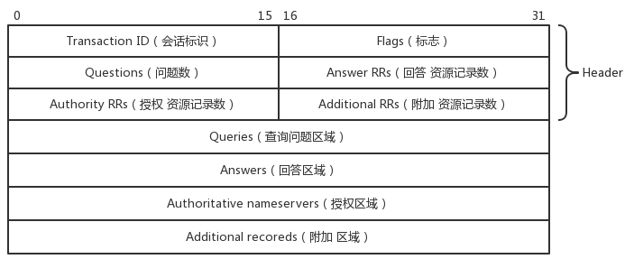
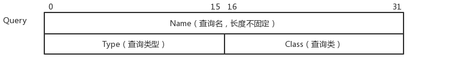
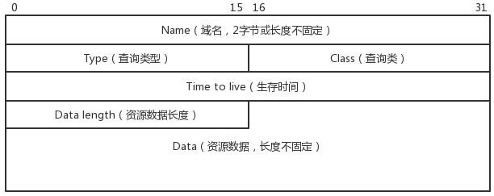
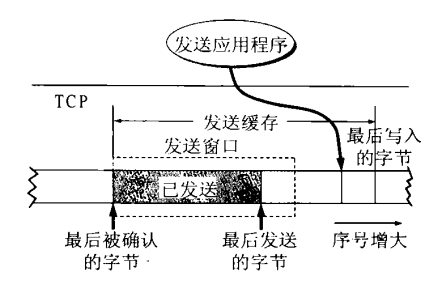
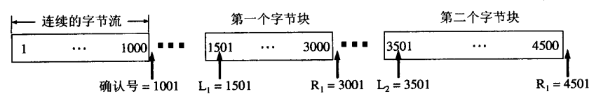

# **网络**

*   ### **在浏览器地址栏输入一个URL后回车，背后会进行哪些技术步骤？**
    -   浏览器先获取到url （Uniform Resource Locator），统一资源定位符：协议（http、https）：//域名（或是IP地址）/路径/文件。
    -   若是获取到的是域名而不是Ip地址（域名越后越高级），则需要查询对应的IP地址，具体的查询过程：
        -   本地hosts文件查询
        -   本地DNS服务器查询（本地DNS服务器一般是由运营商提供，查询本地的DNS服务器是用UDP协议，快，丢失重新请求即可）
        -   向更高级的DNS服务器查询（服务器之间的查询利用的是TCP协议，保证可靠性，请求了一次不需要再请求，减少树顶的服务器压力）
    -   这时候浏览器已经将域名解析成了具体的IP地址了，那么可以由顶往下层层传递，分别根据应用层的HTTP协议，传输层TCP协议，网络层IP、ARP协议等组织请求报文，通过数据链路以及物理层传递到相对应的服务器上，服务器响应发回相对应的报文，浏览器得到数据（通常是HTML）渲染到屏幕上展示给用户。
---

*	**如何为UDP增加可靠性**
    -   请求-应答式应用程序使用UDP的话，那么必须在客户程序中增加以下两个特性：
        -   序列号：客户能验证服务端的应答是否匹配自己发出的相应请求。
        -   超时和重传：用于处理丢失的数据。
            -   因为RTT(Round-Trip Time，同个数据报来回总时间)是随着网络条件的变化而变化的，我们的超时和重传算法必须是采用一个实测的RTT作为基准去设定的。Jacobson算法能够给出了这个算法的细节。
            -   Jacobson无法解决重传二义性问题：
                -   请求丢失
                -   应答丢失
                -   RTO(retransmission timeout, 重传超时)太小
            -   如何解决重传二义性？我们可以对每个请求在加入序列号的同时，加入当前的客户端的时间戳，服务器只需要在做出应答的同时将客户端的时间戳也同样加入到应答中去，客户就能够有效判断应答时对应于哪个请求。
---

*	**TCP与UDP的区别**
    *   TCP是面向连接的字节流传输协议，UDP是无连接的简单传输协议。
    *   TCP是通过对端确认、重传机制、滑动窗口等确保通信是可靠地，单纯的UDP无法保证通信是可靠的。
    *   TCP保证了数据可靠传输，即使它无法保证数据报是顺序到达的，但是接收方能够对数据报进行排序重组。UDP不保证数据报会到达对端，也不保证顺序到达。
    *   TCP一般是一对一。UDP一般可以一对一，一对多，多对多。
    *   TCP一般不会有记录边界的值，而UDP每个数据报都有一个长度值。
---

*   ### **谈一谈TCP/IP五层模型**

    &emsp; TCP/IP五层模型将OSI七层模型中的顶端三层（应用层，会话层，表示层）合并成为应用层，其余的层次是一样的，这五层网络架构、功能以及协议分别是：
    |TCP/IP五层 |  功能|  协议|
    |:---:   | :---:|:---:|
    |应用层  |网页、文件，电子邮件等应用数据格式|HTTP, DNS, Telnet, FTP, SMTP, DHCP|
    |传输层  |建立“端口到端口”的通信|TCP, UDP|
    |网络层  |建立“主机到主机”的通信，提供数据包路由以及MAC地址解析过程|IP, ARP, RARP, ICMP, IGMP|
    |数据链路层  |以帧 (frame) 为单位，提供MAC寻址、数据的检错、重发等功能| Ethernet (以太网), SDLC, HDLC|
    |物理层  |以比特 (bit) 为单位，以物理手段连接计算机，传输数据| IEEE802，IEEE802.2|
---

*   ### **TCP/IP五层模型对应的协议及特性**

    -   数据链路层
        -   
        &emsp;Ethernet (以太网) 协议在数据链路层占据了主导地位
        
        -   规定每一帧的数据都以标头(head) + 数据(data)构成。

        -   标头包含发送者与接收者的MAC物理地址，以太网规定每个接入网络的设备都必须要有网卡接口，而每个网卡设备都有全球唯一的MAC物理地址。

        -   MAC物理地址采用广播地形式向子网络所有计算机发送数据包，同个子网络的所有计算机都会接收到数据包，将数据包的信息与自己MAC地址做比较，符合则接收，否则丢弃。那么不同子网络的计算机无法简单通过数据链路层进行通信，因为产生了提供路由功能的网络层。

    -   网络层
        -   
        &emsp;主要是提供“主机到主机”间的通信过程，包含了同个子网络以及不同子网络间的计算机通信，数据包采用路由的方式发送，每台计算机则包含了两个地址，一个网络地址，一个MAC地址，网络地址帮助数据包先寻找到接收者子网络，再根据MAC地址寻找到对应的计算机。
        -   IPv4协议
            -   协议规定网络地址由32个比特构成，即XXX:XXX:XXX:XXX。每个数字占据8个比特位（1个字节）。从0.0.0.0到255.255.255.255。

            -   IP地址分为两个部分，网络号+主机号，同处一个子网络下的计算机IP地址的网络号都是相同的。

            -   直接从IP地址是无法判断其网络号是前几位，另一个参数子网掩码是用来表示子网络的位数，它形式上与IP地址一样，代表网络号的位上全为1，代表主机号的位上全为0，如果已知网络部分是前24位，主机部分是后8位，那么子网络掩码就是11111111.11111111.11111111.00000000，写成十进制就是255.255.255.0。

            -   通过将计算机的子网掩码与IP地址做AND操作，然后比较计算后的结果，若相同则为相同子网络下的计算机。

        -   ARP协议，根据目的主机的IP地址，获得其MAC地址
            -   网络层的IP数据包放入数据链路层的Ethernet数据包时必须同时包含IP地址以及MAC地址，根据目的主机的IP地址，获得其MAC地址。这就是ARP协议要做的事情。

            -   同一个子网中：ARP request将IP地址填入数据包中，并将MAC地址设置为FF-FF-FF-FF-FF-FF，这个MAC地址表示这是一条ARP广播。子网中目的主机接收到该请求就会发送reply，其中包含自己的MAC地址。

            -   不在同一子网：ARP协议无法解析出MAC地址（如何判断？），将路由器的MAC地址填入数据包中，经由路由器转发出局域网，紧接着用同样方法寻找目的主机，最终在某个子网下解析出目的主机的MAC地址，将数据包交付给目的主机。

        -   ICMP协议，因特网控制报文协议，通常用于返回的错误信息或是分析路由

            -   ICMP数据报包含在IP数据报中，IP报头在ICMP报文的最前面。ICMP协议是在IP协议基础上增加更多的控制信息，IP协议本身是无连接、不可靠的传输协议，因此ICMP也是一种不可靠的传输协议。

            -   Ping工具就是利用ICMP协议的一个典型例子，工具利用ICMP协议的类型字段，包括请求（类型字段值为8）和应答（类型字段值为0）ICMP报文。
        
    -   传输层
        -   
        &emsp;为了建立“端口到端口”之间的通信，每个需要接入网络的进程都需要相对应的占用端口，不然无法知道传过来的数据是哪个进程需要的，传输层就是为在网络层之上进一步确定程序之间的通信。
        -   UDP协议

            -   UDP协议对比IP协议，就是在标头部门再加上发送者与接收者的端口号

            -   UDP是无连接、不可靠的传输协议，它不保证数据能够完整地、顺利地到达目的主机，一旦数据包发出，无法知道对方是否收到。

        -   TCP协议
            -   UDP可靠性较差，而TCP传输协议是一种面向链接、可靠地传输协议。

            -   TCP远比UDP复杂得多，为了达到可靠地传输，它增加了许多运作机制来保证数据能够可靠地达到目的主机：
                -   超时重传
                -   流量控制
                -   拥塞控制
                -   滑动窗口
    -   应用层
        -   
        &emsp;规定应用程序的数据格式，例如网页、电子邮件、终端等的数据格式都不一致，因此需要应用层的协议确保数据能够被进程正确地解读。

        -   FTP协议 --- 文件系统协议
        -   HTTP协议 --- 超文本传输协议，一般用于网页数据传输
        -   Telnet协议 --- Internet远程登录服务的标准协议和主要方式
        -   SMTP协议 --- 简单邮件传输协议，是在Internet传输email的事实标准
        -   DHCP协议 --- 动态主机设定协议，


    &emsp;通常，数据经过应用层、传输层、网络层、数据链路层后，以HTTP、TCP、IP、Ethernet协议为例子，数据包在数据链路层时大致如下图所示：

    ```` 
    ----------------------------------------------------------------------------------
    |     Head     | |     Head     | |     Head     | |     Head     |     Data     |
    ----------------------------------------------------------------------------------
    <- 以太网标头 ->    <- IP标头 ->     <- TCP标头 ->    <- HTTP标头 ->    <- 数据 -> 
    ```` 
---

*   ### **DNS协议实现与原理详解**

    &emsp; DNS数据包到达数据链路层时，其数据包大致如下图所示：
    ```` 
    ----------------------------------------------------------------------------------
    |     Head     | |     Head     | |     Head     | |     Head     |     Data     |
    ----------------------------------------------------------------------------------
    <- 以太网标头 ->    <- IP标头 ->     <- UDP标头 ->    <- DNS标头 ->    <- 数据 -> 
                                        <- TCP标头 ->
    ```` 
---

*   ### **DNS协议的理论知识**
    <div align=center>
    
    </div>

    -   早期的单一档案处理上网过程：
        -  
        -   web服务器在档案中心进行注册

        -   档案中心人员将网站名称写入特定的档案内（一旦主机过多，档案文件就会急剧增大）

        -   上网前访问档案中心下载更新本地hosts文件，位于/ect/hosts

        -   根据下载的档案找出对应的IP地址进行访问

    &emsp;此方法适用于主机数量较少的时代，当上网人数急剧增加时，会使得文件非常大，需要长时间等待hosts文件更新。

    <div align=center>
    
    </div>

    -   分布式、阶层式 DNS (Domain name System) 系统：
        -   
        -   树状结构，主机名管理分配在不同的层级，分层管理

        -   每层服务器记忆信息不多，维护变得更容易

        -   每层的每台DNS服务器只需维护所属的领域下的DNS服务器的主机名与IP地址

        -   IP变动，只需要修改自己所属的DNS服务器，不需要上层的ISP维护

    <div align=center>
    
    </div>

    -   client查询IP地址的过程：
        -   
        -   client欲访问 www.ksu.edu.tw，则先查询本地/etc/hosts文件是否有对应的IP地址，若有则直接返回IP地址，若无则继续查询。

        -   client向local DNS server (LDNS，一般以/etx/resolv.conf为依据) 递归查询主机名 www.ksu.edu.tw 的IP地址，DNS server会先查询自己缓存中是否有此记录，若有则返回消息给client，若无则继续查询。

        -   LDNS向根域名服务器 .(root) 进行查询，返回 .tw. DNS服务器的IP地址

        -   LDNS向 .tw. DNS服务器进行查询，返回 .edu.tw. DNS服务器的IP地址

        -   LDNS向 .edu.tw. DNS服务器进行查询，返回 .ksu.edu.tw. DNS服务器的IP地址

        -   LDNS向 .ksu.edu.tw. DNS服务器进行查询，将client要查询主机名所对应的IP地址返回给LDS

        -   LDNS将结果查询的结果发送给client，并且将记录暂存于自身的缓存中以备下一次访问，暂存是有时间性的(通常可能是 24 小时)，过了时间就会被释放。

    &emsp; DNS协议是应用层协议，而查询过程是使用网络查询的，DNS默认使用的端口是53，包含了53/tcp端口以及53/udp端口，通常 DNS 查询的时候，是以 udp 这个较快速的数据传输协议来查询的， 但是万一没有办法查询到完整的信息时，就会再次以 tcp 这个协定来重新查询的。在linux下/etc/services档案主要记录网络服务名和它们对应使用的端口号及协议。

    -   端口划分[0-65535]，16位：
        -   
        -   [1, 1023] 系统保留，只能由root用户使用

        -   [1024, 4999] 由客户端程序自由分配

        -   [5000, 65535] 由服务器端程序自由分配

----

*   ### **DNS协议报文格式**

<div align=center>

</div>

&emsp;DNS报文的格式如上面的图例所示，请求或是应答的报文格式都依据上面的格式发送。报文总体可以分为两大部分：
-   Header（头部）
    -   
    -   Transaction ID 会话标志（2字节）：是DNS报文的ID标识，请求报文和其对应的应答报文的这个字段是相同的，通过它区分DNS应答报文是对应哪个请求。

    -   Flags 标志（2字节）如下图所示
            <div align=center>
            
            </div> 
        |描述位 |  功能|
        |:---: |:---:|
        |QR（1bit） |  查询/响应标志，0为查询，1为响应|
        |opcode（4bit） |  0表示标准查询，1表示反向查询，2表示服务器状态请求|
        |AA（1bit） |  表示授权回答|
        |TC（1bit） |  表示可截断的|
        |RD（1bit） |  表示期望递归|
        |RA（1bit） |  表示可用递归|
        |rcode（4bit）	 |  表示返回码，0表示没有差错，3表示名字差错，2表示服务器错误（Server Failure）|

    -   四个数量字段（每个字段2个字节，共8个字节）：四个字段各自表示后面的四个区域的字节大小。Questions->查询问题区域RR，Answers->回答区域RR，Authority RRs->授权区域RR，Additional RRS->附加区域RR。资源记录Resource Record (RR)。
-   Data (正文)
    -   
    -   Queries（查询问题区域）的数据格式，正解数据 (Resource Record, RR)：
            <div align=center>
            
            </div> 

        -   Name查询名（4n字节，长度不固定）：正向查询->域名（例如，www.baidu.com），反向查询->IP地址

        -   Type查询类型 （2字节）：
            |标记符 |  符号所表示的含义|
            |:---: |:---:|
            |A |  查询域名返回的IPv4地址|
            |AAAA | 查询域名返回的IPv6地址|
            |NS |  管理这个领域名的服务器主机名字|
            |SOA |   管理这个领域名的七个重要参数，(1)Master DNS 服务器主机名，(2)管理员的email，(3)序号，代表的是这个数据库档案的新旧，(4)slave更新频率，(5)失败重新尝试时间，(6)slave更新失效时间，(7)暂存时间（泛定义的）|
            |CNAME |  实际代表这个主机别名的主机名字|
            |PTR |  查询 IP 所对应的主机名|
            |MX |   接收邮件的服务器主机名字|
            
        -   Class查询类 （2字节）：通常为 1 ，表示Internet (IN)。

    -   Answers（回答区域）、Authoritative nameservers（授权区域）、Additional records（附加区域）数据格式都相同，统称为资源记录区域 (RR)，如下：
            <div align=center>
            
            </div> 

        -   Name域名（4n字节，长度不固定）：正向查询->域名（例如，www.baidu.com），反向查询->IP地址，在这个区域不会重复Queries区域的数据，而是利用偏移指针直接指向Queries区域中的查询名。

        -   Type查询类型 （2字节）：与Queries一致。
        
        -   Class查询类 （2字节）：通常为 1 ，表示Internet (IN)。
                
        -   Time to live （TTL，缓存时间）：以秒为单位，表示的是资源记录的生命周期，一般用于当地址解析程序取出资源记录后保存在缓存的时间，时间到了就释放资源。

        -   Data length （2字节，资源长度）：表示下面的资源数据总字节长度。

        -   Data（2n字节，长度不固定）：表示按照查询段的要求返回的相关资源记录的数据。可以是Address（表明查询报文想要的回应是一个IP地址）或者CNAME（表明查询报文想要的回应是一个规范主机名）等。
---

*   ### **epoll底层实现机制？epoll的ET、LT模式在编程上需要注意什么？**

    ``` C++
    int epoll_create(int size)；
    int epoll_ctl(int epfd, int op, int fd, struct epoll_event *event)；
    int epoll_wait(int epfd, struct epoll_event * events, int maxevents, int timeout);
    ```

    *   epoll高效支持百万级别的句柄监听是由上面提到的三个函数完成的，**epoll_create, epoll_ctl, epoll_wait**，这三个函数底层实现与高效息息相关。

    *   **int epoll_create(int size)** ：内核根据传入参数 size 为 eventpoll 结构体分配内存
    ``` C++
    // epoll的核心实现对应于一个epoll描述符
    struct eventpoll {
        ......
        // 双向链表：存储已就绪的需要检查的epitem
        struct list_head rdllist;  
        /* 红黑树结构体：保存所有加入到当前epoll的文件对应的epitem, 
            高效地处理epoll_ctl的增删改，查是增之前会查 */
        struct rb_root rbr;  
        ......
    }
    ```

    *   **int epoll_ctl(int epfd, int op, int fd, struct epoll_event event)** ：根据得到的 epfd 更新 eventpoll 结构体的红黑树 rbr。
        *   **epfd**：是epoll_create()的返回值。
        *   **op**：表示op操作，用三个宏来表示：添加EPOLL_CTL_ADD，删除EPOLL_CTL_DEL，修改EPOLL_CTL_MOD。分别添加、删除和修改对fd的监听事件。
        *   **fd**: 是感兴趣的描述符
        *   **epoll_event**： 感兴趣的事件

        当 **op** 为 EPOLL_CTL_ADD时，为描述符fd以及感兴趣的事件创建 **struct epitem** 条目，并在红黑树中插入新的节点并向内核注册回调函数。当事件被触发时，回调函数就会被调用。例如某个描述符的事件被触发，回调函数就可以把这个事件放入到就绪链表list中，等待处理。

    ``` C++
    // 对应于一个加入到epoll的条目
    struct epitem {  
        ......
        // 挂载到eventpoll 的红黑树节点  
        struct rb_node rbn;  
        // 挂载到eventpoll.rdllist 的节点  
        struct list_head rdllink;  
        /* 文件描述符信息fd + file, 红黑树的key */  
        struct epoll_filefd ffd;  
        // 当前epitem 的所有者  
        struct eventpoll *ep;
        /* epoll_ctl 传入的用户数据 */  
        struct epoll_event event;
        ......
    };  

    // 文件描述符信息fd + file, 红黑树的key
    struct epoll_filefd {  
        struct file *file;  
        int fd;  
    };  

    // 用户使用的epoll_event  
    struct epoll_event {  
        __u32 events;  
        __u64 data;  
    } EPOLL_PACKED;  

    //上述epoll_event中的events可以是以下几个宏的集合：
    EPOLLIN ：表示对应的文件描述符可以读（包括对端SOCKET正常关闭）；
    EPOLLOUT：表示对应的文件描述符可以写；
    EPOLLPRI：表示对应的文件描述符有紧急的数据可读（这里应该表示有带外数据到来）；
    EPOLLERR：表示对应的文件描述符发生错误；
    EPOLLHUP：表示对应的文件描述符被挂断；
    EPOLLET： 将EPOLL设为边缘触发(Edge Triggered)模式，而水平触发(Level Triggered)是默认缺省值。
    EPOLLONESHOT：只监听一次事件，当监听完这次事件之后，如果还需要继续监听这个socket的话，需要再次把这个socket加入到EPOLL队列里
    ```

    *   **int epoll_wait(int epfd, struct epoll_event * events, int maxevents, int timeout)** : 查看就绪链表list中是否有存在就绪事件
        -   有，将数据复制到参数events中并返回
        -   没有，则阻塞，当timeout到了则返回。

    *   **ET（边缘触发）与LT（水平触发），EPOLLET设置，后者为默认行为**
        -   LT水平触发模式下，描述符的事件上若还有未处理的事件时，它会被再次添加到就绪链表list上，等待下一次的epoll_wait调用，因此在LT模式，可以多次性处理。
        -   ET边缘触发模式下，数据必须一次性处理完成，否则其对应 epitem 是不会重新放入就绪列表list上
        -   ET模式是高效工作模式，不会像LT模式一样，不断地重复触发。
        -   在编程的过程中，针对ET模式的描述符，若是recv()返回的大小恰好等于请求的大小，那么这时候可能就会存在还有未读完的数据在缓冲区中，必须重复读取，直至返回的大小小于请求的大小才能完成事件处理。
--- 

*   ### **TCP三次握手过程、TCP四次挥手过程**
    * TCP/IP 三次握手、四次挥手总结
        - TCP （Transmission Control Protocol） 是含有“面向连接”特性属于传输层协议，也就是说在正式通信前必须与对方建立可靠地连接
        - 三次握手就是为了建立一种可靠地连接
        - TCP 是一种可靠地数据传输，如何达到可靠地传输靠的就是在数据传输时的协议
        - 四次挥手是为了断开连接

* 三次握手 (客户端张三，服务端李四)

    * 过程如下:
        - 张三向李四打招呼 （client向server发送一个syn）
        - 李四看到后向张三笑了一笑 （server向client发送ack）
        - 李四害怕张三不是向自己打招呼，再向李四打招呼 （server向client发送了一个syn）
        - 张三知道李四是为了确认自己，因此他也向李四笑了一笑 （client向server发送ack）

    * 过程简化:
        过程尽管有四个，但是在中间过程中server向client发送ack+syn可以进行合并为一个连续地发送，因此最终为三次握手过程

    * 过程的状态变化：
        - 无论是client还是server都有一个中间过渡态（从listening->中间态->established的状态）
        - client的过渡态是syn_sent (syn package has been sent)，server的过渡态是syn_rcvd (syn package has been received)
        - 这两个状态叫着「半打开」状态，实则就是向对方招手了，但是还没来得及看到对方的点头微笑


* TCP数据可靠传输 (客户端张三，服务端李四)
    * 数据地可靠传输是在建立起了可靠连接后进行的，这时候客户端以及服务端都应该是established的状态，这样两者才可以进行数据传输。

    * 过程如下:
        - 张三告诉李四一些话 (client向server发送data)
            + 张三可以连续向李四发送多个数据，而不用一个一个发送，两人之间需要有协商好的合适的发送和接受速率，这个就是「TCP窗口大小」
        - 李四向张三点点头 (server向client发送ack)
            + 李四可以在接受完多个数据后，一起向张三回复说前面你说的那些话我都听见了，这就是批量ack。

    * 如何可靠:
        - 重传机制：clinet告诉server的话被大风吹走或者是server回复client的话被大风吹走，这时候client需要重传数据
        - 去重机制：server就有可能同一句话听见了两次，server必须将重复的话给去掉


* 四次挥手 (客户端张三，服务端李四)

    * 过程如下:
        - 张三向李四挥挥手（client向server发送一个fin）
        - 李四看到后向张三离别地笑了一笑 （server向client发送ack）
        - 李四在说完所有的话后累了，向张三也挥挥手 （server向client发送了一个fin）
        - 张三也向李四离别地笑了一笑 （client向server发送ack）

    * 过程不简化:
        - 中间的两个动作之所以没有合并，是因为tcp存在「半关闭」状态，也就是单向关闭。张三向李四挥挥手，可是人还没有走，只是不再说话，但是耳朵还是可以继续听，李四可以继续说话（发送数据给张三），等待李四累了，也不再说话了，朝张三挥了挥手，张三伤感地微笑了一下，才彻底结束了。


    * 过程的状态变化：
        - 有一个非常特殊的状态time_wait，参考知乎，说的挺好的。

---
*   ### **TCP 可靠传输的依据**


    *   TCP是一种以全双工方式工作的通信协议，它能够保证通信双方是可靠地通信，确保它可靠地通信除了在建立连接过程中的三次握手以及断开连接四次挥手之外，TCP的可靠性还由窗口滑动机制、缓存机制、超时重传机制、选择确认SACK机制、拥塞控制等来保证其通信是可靠地，下面主要介绍这几种机制。

    *   滑动窗口机制
        <div align=center>
        
        </div>

        *   TCP传输是以字节为单位进行传输的，现在假设每个数字代表1个字节的数据，图上的所有数字代表为1个字节数据。
        *   TCP是以全双工方式工作，这里简要的介绍A为发送者，B为接收者，这种单向通信的方式在全双工工作也是一样的。
        *   发送者的数据序列有四种状态，依次为：已发送并收到确认、已发送但未收到确认、允许发送但尚未发送、不允许发送。
            * 发送窗口表示：在没有收到B的确认的情况下，可以**连续把窗口内的数据发送出去**。凡是已经发送过的数据，在未收到确认之前都必须暂时保留（上图涂黑部分），以便超时重传使用。
            *   窗口大小由P3-P1决定，P1指针（窗口后沿）始终在收到确认与没有收到确认的边界上，前移的过程则是陆续收到确认的过程。四个部分利用三个指针分割。P2->P3部分有可能是因为**TCP缓冲区**中还没有这些数据，因此还没有发送出去，也有可能是正在发送的过程中。
        *   接收者仅有2个指针标记接收窗口，三种状态分别是：已发送确认并交付主机、允许接收、不允许接收
            *   接收窗口后沿是**已接收到的数据并已发送确认**与允许接收的分界线，窗口前沿是允许接收和不允许接收的分界线。
            *   由图上显然可以看出**未按序到达的字节**并不给予发送ACK而只是对序列号进行一种标记，依旧等待接收窗口后沿的数据到达（例如上图等待着34的到达，却不会发送37，38的ACK），接收者**只对有序的序列号字节数发送ACK**（是否是为了确保发送者指针P1的有序移动？）。
        *   发送者发送窗口的前沿与接受者接收窗口的前沿必须是一致的。


    *   缓存机制

        <div align=center>
        
        </div>

        *   发送缓冲区大小必定是大于发送者滑动窗口的大小，其主要保存：
            *   涂黑部分为已发送但未收到确认，必须得保存（重传机制）
            *   即将发送部分，但未发送
        *   发送缓冲区的后沿与发送滑动窗口后沿是一致的

        <div align=center>
        
        </div>

        *   接收缓冲区大小必定是大于接收者滑动窗口的大小，其主要保存：
            *   已接收也发送了确认(大块涂黑部分)，发送的ACK有可能丢失
            *   未按序到达的数据（小块涂黑部分），不发送ACK，先存着

    *   超时重传机制
        *   TCP每发送一个报文段，就对这个报文段设置一次计时器。只要计时器设置的重传时间到还没有收到确认，就要重传这个报文段。
        *   超时重传时间：
            *   平均往返时延RTT=α ×（旧的RTT）+（1-α）×（新的往返时延样本），1 ≤ α ＜ 1 典型的值为α为7/8（旧RTT权重更大）
            *   超时重传时间必须大于RTT是显然的：RTO = β × RTT, β ＞ 1， 推荐是2，也就是建议超时重传的时间是平均往返时延RTT的两倍
        
    *   选择确认SACK

        <div align=center>
        
        </div>

        *   接收者若收到的报文段无差错，只是未按序号，中间还缺少一些序号的数据，采用选择确认的方法来传送缺少的数据，而不重传已经正确接收到的数据。
        *   接收方就先收下这些数据，但要把这些信息准确的告诉发送方，使发送方不要在重复发送这些已经收到的数据

    *   拥塞控制

        <div align=center>
        
        </div>

        *   慢开始、拥塞控制 
        *   快重传、快恢复
---

*   ### **close与shutdown的区别**

    <div align=center>
    
    </div>

    *   上图为并发服务器的一般框架图，服务器为每个客户fork一个子进程处理相应的服务，主进程不阻塞，继续监听等待新的客户连接。
    *   close的用法：
        *   每个文件描述符（listenfd, connfd）有一个引用计算，当父进程调用close(connfd)时，只是将connfd的引用计数-1，并不会终止它与客户的连接。
        *   子进程调用close(connfd)时，将connfd的引用计数-1，此时引用计数为0，该文件描述符的真正清理和资源释放才会进行。
        *   对于并发服务器，父进程必须调用close关闭connfd，否则当子进程调用close时是不会发生描述符清理以及资源释放的，这会导致连接一直打开，最终将所有可用描述符消耗殆尽。
    *   shutdown的用法：
        *   使用shutdown可以避免close的引用计数方式，直接激发TCP的正常连接终止序列。
        *   close激发TCP终止序列后，终止的是两个方向的读（SHUT_RD）以及写（SHUT_WR）。shutdown可选择关闭读或者是写其中之一，这时候TCP套接字为半关闭状态。
        *   shutdown还可以同时关闭读与写（SHUT_RDWR）。
---

*   ### **HTTPS与HTTP的区别**
    *   HTTPS = HTTP + SSL / TLS， SSL是TLS的前身，前者存在安全漏洞，已经很少被使用到。
    *   HTTP是超文本传输协议，以明文形式在网络上传输，HTTPS 是将明文信息加密后再进行传输，更安全，而SSL就是起加密作用。
    *   默认端口不同， HTTP为80，HTTPS为443。
    *   HTTP是无状态的连接，HTTPS协议是由SSL+HTTP协议构建的可进行加密传输、身份认证的网络协议，比HTTP协议安全。
        -   无状态意味着：
            -   每一次请求是独立的
            -   不保存客户信息、也不保存会话
---

*   ### **HTTP的响应状态码**
    访问网页时，浏览器会向web服务器发出请求，服务器会返回一个包含HTTP状态码的信息头用以响应请求。
    *   状态码分类：
        -   1XX - 信息型，要求请求者继续尝试
        -   2XX - 成功型，请求成功，理解并处理
        -   3XX - 重定向，需要进一步操作以完成请求
        -   4XX - 客户端错误，请求包含语法错误或无法完成请求
        -   5XX - 服务器错误，服务器处理请求过程发生错误

    *   常见状态码：
        -   200 - 请求成功
        -   301 - 资源被永久转移到其它URL
        -   302 - 资源临时移动，客户端应继续使用原有URL
        -   304 - 请求资源未修改，客户端缓存中存在
        -   404 - 请求资源不存在，或许是错误URL
        -   500 - 服务器内部错误，无法完成请求
        -   503 - 服务器超载或维护，服务器暂时的无法处理客户端的请求
---     

*   ### **HTTP/1.0与HTTP/1.1的区别**
    *   HTTP/1.0 版的主要缺点是，每个TCP连接只能发送一个请求。发送数据完毕，连接就关闭，如果还要请求其他资源，就必须再新建一个连接。

    *   HTTP/1.1引入了持久连接，TCP连接默认不关闭，可以被多个请求复用，无需像HTTP/1.0声明Connection:keep-alive。

    *   HTTP/1.1引入了管道机制，在一个TCP链接里，客户端可以同时发送多个请求，例如请求资源A与资源B，可以在一个TCP链接里同时发送请求资源A与请求资源B，但服务器的返回必须是按序的。

    *   HTTP/1.1引入了Content-length字段，明确告诉浏览器此数据包长度，此字节长度后面的数据包属于下个回应，多个回应对应多个请求，无此字段无法分辨回应长度。

    *   HTTP/1.1引入了分块传输替换Content-length，Content-length因为是每次回应的长度大小，若后面的数据获取较为耗时，则一直等待不发送前面的数据，而分块传输则避免这个问题，每次块数据可以发送后，则将其发送，利用数据块头部标出此数据块的大小长度，最后一个数据块为全0标志结束。

    *   HTTP/1.1尽管允许同时发送请求，但服务器处理每个请求是按序处理的，要是前面的请求是耗时的，后面的请求就会被阻塞，这称为“队头阻塞”。
---

*   ### **HTTP/2新特性**

    *    为解决“队头阻塞”，HTTP/2引入了多路复用机制，每一路为一个流，数据包含有对应的id进行识别，而客户端和服务端可以通过发送信号取消数据流，而不用像HTTP/1.1通过断开TCP连接来断开取消数据发送。

    *   头部压缩，由于HTTP是无状态的协议，所以很多请求的字段都是重复的，头部重复的信息可以通过算法进行压缩再发送，双方也可以同时维护一张表，只需要发送偏移量就可以找到头部信息，提高了速度。

    *   服务器推送，服务器能够将静态资源（例如图片）一起推送给客户端，避免再次请求。

---


