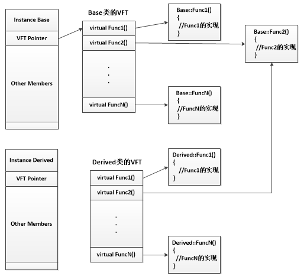

# 面试常见问题

*   **new和malloc的区别，placement new, operator new？**
    - new是一种操作符(对象内默认的操作符)，malloc是一个函数
    -   new申请内存返回的类型是对象类型的指针（与对象匹配），而malloc只是单纯地被通知去申请多大的内存块它的返回是无类型指针、需要强制类型转换
    -   new和delete（操作符可重载）会调用对应的构造函数以及析构函数完成对象的创建与析构，malloc和free根据指针申请与释放内存块
    -   new具体步骤：
        -   调用operator new分配足够的内存空间
        -   调用对象的构造函数初始化
        -   构造完毕，返回该对象的类型指针
    -   malloc具体步骤：申请给定参数的内存块

*   **c++中class和struct的主要区别？**
    -   默认继承权限：class是private，struct是public
    -   默认成员函数访问权限：class是private，struct是public

*   **四次挥手过程，为什么不能直接三次挥手？类似于三次握手过程？**
    -   在主动方接收到被动方的ACK时只是告诉对方，我们不发数据了，但是还可以接收数据，在接收ack与发送fin之间可能还会接收到数据，因此不能够直接选择发送 FIN。

*   **红黑树、B+树、B树的区别**

	
	

    -   B+树与B树区别：
        -   B+树是B树的升级版，B树的每个节点都保存指向数据的指针，而B+树只会在叶子节点上保存指向数据的指针，因此B+树叶子节点是包含了所有的索引的，而B树在每一个节点都有索引及指向数据的指针。
        -   B+树对磁盘友好：
            -   内部节点不含指向数据的指针，节省了一定的磁盘占用，使得内部索引尽可能在一个块内存储，相同节点的B+树必定更加矮胖，查询的效率对比B树肯定更加高。
            -   查询效率稳定，所有索引最终指向叶子节点，查询必须经过根到叶子的路径。
            -   B+树的遍历可以利用叶子节点间链表串联的方式遍历，而B树就必须利用中序遍历了（往返顺序查找等）。

	
	
    -   红黑树性质：
        -   节点是黑色或者红色
        -   根节点是黑色的
        -   所有叶子节点是黑色的（叶子节点是null节点）
        -   从根节点到叶子节点的路径上黑色节点数量必须是相同的
        -   若父节点是红色的，则其两个子节点必须是黑色的
    -   红黑树弱平衡保证了插入删除查询最坏操作都是O(logN):
        -   因为一条路径上（根到叶子）的黑色节点数量必须相同，那么最短的路径则有可能是全部为黑色，最长的则可能是红色连续交替，这些性质保证了其最长路径不会超过最短路径的2倍，保证了logn的分叉。

*   **cout和printf区别**
    -   cout定义在iostream中的一种对象类型，printf是定义在stdio.h头文件中的一种函数
    -   cout更安全，内含大量的运算符重载，可以输出各种基本数据类型，printf需要严格定义的数据类型才可以对应输出

*   **sizeof和strlen的区别**
    -   sizeof类似于new一样也是操作符，strlen是函数
    -   sizeof的操作对象可以是变量、函数、表达式、数据类型、对象等等，而strlen的传入参数是char*指针，它主要计算字符串长度，遇到结束标识符时返回其长度。
    -   sizeof编译已经确定好要返回的大小，strlen是在运行时计算字符串长度。

*   **在浏览器地址栏输入一个URL后回车，背后会进行哪些技术步骤？**
    -   浏览器先获取到url （Uniform Resource Locator），统一资源定位符：协议（http、https）：//域名（或是IP地址）/路径/文件。
    -   若是获取到的是域名而不是Ip地址（域名越后越高级），则需要查询对应的IP地址，具体的查询过程：
        -   本地hosts文件查询
        -   本地DNS服务器查询（本地DNS服务器一般是由运营商提供，查询本地的DNS服务器是用UDP协议，快，丢失重新请求即可）
        -   向更高级的DNS服务器查询（服务器之间的查询利用的是TCP协议，保证可靠性，请求了一次不需要再请求，减少树顶的服务器压力）
    -   这时候浏览器已经将域名解析成了具体的IP地址了，那么可以由顶往下层层传递，分别根据应用层的HTTP协议，传输层TCP协议，网络层IP、ARP协议等组织请求报文，通过数据链路以及物理层传递到相对应的服务器上，服务器响应发回相对应的报文，浏览器得到数据（通常是HTML）渲染到屏幕上展示给用户。

*   **进程间通信方式：**
    -   无名管道：有血缘关系的进程中使用，通常是父子关系。
    -   有名管道：任意进程中都可以用有名管道通信。
    -   消息队列：消息队列的话可以被认为是一个消息链表。某个进程放置消息，其余进程可以根据需求去读取消息。管道得先有读取者，写入才有意义，消息队列不需要这样。
    -   信号量、互斥量、读写锁等同步手段：应该是与线程类似的锁机制。
    -   共享内存（回答的时候可以深入这一块讲）：是IPC（interprocess communication, 进程间通信）形式中最快的，不需要执行内核的系统调用来传递数据。假设在文件复制过程中，利用管道、FIFO、消息列队进行进程间通信时，我们总共是需要4个系统调用，包含了文件到某个进程、进程到管道、FIFO、消息列队，管道、FIFO、消息列队到另外一个进程，另外一个进程到文件，四次数据复制过程，比较耗时，共享内存区只需在进程中控制文件读取到共享内存区，再由另外一个进程将共享内存区的数据复制到输出文件即可，总共2次系统调用。
    -   套接字：TCP与UDP这些。


*   **线程间通信方式：**
    -   线程间通信主要是为了线程同步，没有数据交换的通信机制。线程并发执行，能够共享进程中共享内存区，例如堆数据、全局变量等
    -   线程安全机制：
        -   锁机制。线程访问资源前必须获得其锁，若是锁已经被占有则需要等待，线程访问结束后释放锁。
        -   信号量。锁机制一种，分二元与多元信号量，多元信号量n，每个线程访问时将信号量-1，当n等于0时则等待，二元信号量则是n=1;
        -   互斥量。比信号量更严格，某个线程获取信号量后必须由它自身释放，其余线程释放无效。
        -   临界区。比互斥量更严格，临界区内的资源只允许本进程去试图访问，其余进程不允许。
        -   读写锁。是为了在读的情况下允许高并发访问，写的情况下执行锁机制，锁状态包含自由、共享、独占，要想独占得等到锁自由才可以。

*   **死锁（互相等待对方的资源）的四个必要条件**
    -   互斥：一个资源每次只能被一个进程所持有
    -   占有且等待：进程因请求资源阻塞时不会释放自己已持有资源
    -   不可强行占有：不可强行剥夺进程占有资源，除非进程已停止释放了资源
    -   循环等待：若干多个进程形成头尾相接的等待资源关系
        -   银行家算法能够有效地避免死锁：
            -   银行家算法是操作系统通过维护4个表，判断能够给予进程资源，让进程运行的依据。
            -   allocation：进程已持有资源
            -   max：进程需要的最大资源
            -   available：目前操作系统所剩余资源（可被获得资源）
            -   need：max-allocation，进程还需要多少资源才能继续运行
            -   实际上就是维护两个表need, available，need小于available则赋予其运行权利。

*   **进程、线程的状态**
    -   线程：就绪（可以立马运行，但没有CPU时间片）、等待（等待资源释放）、运行
    -   进程：
        -   R（可执行状态）
        -   S（可中断睡眠状态，等待唤醒）
        -   D（不可中断睡眠状态），例如执行vfork系统调用后，父进程将进入TASK_UNINTERRUPTIBLE状态，直到子进程调用exit或exec
        -   T（暂停或者跟踪状态）
        -   Z（僵尸进程、僵死状态，留下空壳（包含退出信息）给父进程查阅
        -   X（退出状态、进程即将销毁）


*   **数据库事务的属性（ACID）**
    -   Atomicity原子性：要么执行要么不执行
    -   Consistent一致性：数据库状态转换必须保持一致。300+300->400+200
    -   Isolation隔离性：事务之间不会相互影响。
    -   Durability持久性：事务提交成功，则永久保存在数据库内。

*	**如何为UDP增加可靠性**
    -   请求-应答式应用程序使用UDP的话，那么必须在客户程序中增加以下两个特性：
        -   序列号：客户能验证服务端的应答是否匹配自己发出的相应请求。
        -   超时和重传：用于处理丢失的数据。
            -   因为RTT(Round-Trip Time，同个数据报来回总时间)是随着网络条件的变化而变化的，我们的超时和重传算法必须是采用一个实测的RTT作为基准去设定的。Jacobson算法能够给出了这个算法的细节。
            -   Jacobson无法解决重传二义性问题：
                -   请求丢失
                -   应答丢失
                -   RTO(retransmission timeout, 重传超时)太小
            -   如何解决重传二义性？我们可以对每个请求在加入序列号的同时，加入当前的客户端的时间戳，服务器只需要在做出应答的同时将客户端的时间戳也同样加入到应答中去，客户就能够有效判断应答时对应于哪个请求。
    
*	**TCP与UDP的区别**
    *   TCP是面向连接的字节流传输协议，UDP是无连接的简单传输协议。
    *   TCP是通过对端确认、重传机制、滑动窗口等确保通信是可靠地，单纯的UDP无法保证通信是可靠的。
    *   TCP保证了数据可靠传输，即使它无法保证数据报是顺序到达的，但是接收方能够对数据报进行排序重组。UDP不保证数据报会到达对端，也不保证顺序到达。
    *   TCP一般是一对一。UDP一般可以一对一，一对多，多对多。
    *   TCP一般不会有记录边界的值，而UDP每个数据报都有一个长度值。

*	**static 静态函数、静态全局变量、静态局部变量、静态成员变量、静态成员函数**
	-	当static修饰一个函数时（**静态函数**，面向过程）
		-	函数只可以被本文件的其余函数调用，不可以跨文件调用
		-	其他文件有相同函数名时，不会发生冲突
	-	当static修饰一个全局变量时（**静态全部变量**，面向过程）
		-	静态全局变量只对本文件上有效，其余文件即使用了extern也无法引用静态全局变量
		-	与其余文件有着相同变量的全局变量不会发生冲突
	-	当static修饰一个局部变量时（**静态局部变量**，面向过程）
		-	静态局部变量与静态全局变量是存储在进程的数据区(已初始化的变量存储在.data段、未初始化的变量存储在.bss段)
		-	静态局部变量只在作用域内有效，出了作用域是无效的，但其始终驻留在数据区直到程序结束
		-	初始化只在第一次有效，其余无效
    -   当static修饰一个成员变量时（**静态成员变量**，面向对象）
        -   这个变量是所有对象所共有的。普通变量每个对象实例都有自己的一份拷贝，而静态成员变量不是的，所有对象实例共享一份。
        -   静态成员变量同样存储在数据区，内存在初始化时才分配，静态成员变量必须初始化，而且只能在类体外进行初始化。
        -   静态成员变量不需要通过某个实例访问，直接访问这个类::变量即可
    -   当static修饰一个成员函数时（**静态成员函数**，面向对象）
        -   静态成员函数属于类的本身，不属于任何一个实例对象，不具备this指针。**因此不能够访问非静态成员函数与非静态变量，只能访问静态成员函数与静态变量**
        -   静态成员函数与静态成员变量一样可以通过类::函数，类::变量直接访问。

*	**谈一谈volatile关键字**
	-	阻止编译器为了提高速度将一个变量缓存到寄存器内而不写回，读取某个值到寄存器操作后必须写回变量里
	-	阻止编译器调整操作volatile变量的指令顺序，即使能够阻止编译器优化，也无法阻止CPU动态调度
		-	这里可以延伸去讲singleton（如何创建单例模式的过程）
			-	new的第二和第三个过程因为CPU的动态调度被交换：
				-	分配内存
				-	调用构造函数
				-	返回内存地址地址给用户
			``` c++
			#define barrier() ___asm___ volatile ("lwsync")
			volatile T* pInst = 0;
			T* GetInstance(){
				if (pInst == NULL) {
					lock();
					if (pInst == NULL) {
						T* temp = new T;
						barrier(); // 建立水坝，cpu动态调度无法穿越这个水坝进行乱序执行
						pInst = temp;
					}
					unlock();
				}
				return pInst;
			}
			```

*   **说一下Redis的优劣势**
    -   优点：
        -   高速缓存，Redis读的速度能高达10万/s，写的速度能高达8万/s
        -   丰富的数据类型，支持string字符串、list列表、set集合、sorted set有序集合、hash哈希五类对象
            -   Redis的string与C语言里设计的字符串较为不同，Redis字符串是一个结构体，其包裹着三个变量，两个int（free、len）、一个char[]（buf）。
            -   列表对象一般底层实现是压缩列表，压缩列表是为了节约内存而开发出来的，它能够节约内存在于它是连续内存块组成的结构，减少内存碎片的产生，每一块内存都保存着例如是它的实体，长度，尾节点偏移量等等。列表还有另外一种底层实现：链表，与我们平常所用的双向链表没有太大的不同，特别的就是它会用一个大的结构体持有整个链表，因此可以非常迅速地找到头节点与尾节点，它的节点值是void*类型，保证了多态性。
            -   有序集合对象与哈希对象可以联合一起来说，有序集合对象在底层实现的时候一般采用字典与跳跃表联合的方式，字典作用在于：保存键与权重，O(1)获得对应键的权重，跳跃表作用则在于范围型查找，通过一种跳跃节点形式加速范围型查找，是因为每个节点都保存了一个level结构体数组，结构体数组里面包含了一个跨度与前进指针，通过跨度的判断就能够知道跳跃了多少个节点。
        -   支持对数据的持久化
            -   AOF与RDB是Redis持久化的两种手段，他们存储手段各有其特点
                -   RDB (Redis DataBase)：数据库存储快照（压缩的）
                    -   SAVE与BGSAVE命令都是保存数据库快照的命令了，他们不同的地方在于一个是在主进程上执行，一个是fork()后执行。
                    -   RDB存储下来的文件是以Redis设置的协议格式存储键值对，是为了在数据库加载rdb文件时快速执行
                    -   RDB是一种自动性间隔保存，调用的是BGSAVE，它不好的地方就在于如果在两次存储之间服务器宕机了，则会丢失这段时间的数据
                -   AOF（Append Only File）：
                    -   通过执行的写命令来记录数据库状态的
                    -   AOF的效率可以达到每秒更新一个AOF文件，因此即使出现故障停机，也只会丢失一秒钟内的数据
                    -   AOF一个坏处就是记录写的命令会导致这个非常地大，AOF重写文件机制可以改善这个坏处
                    -   AOF加载过程实际上是模拟一个客户端访问数据库，不停执行保存在文件的命令。
        -   Redis也支持事务，符合ACID原则
    -   缺点：
        -   AOF与RDB持久化在服务器重启过程的加载时间会比较久，而在这个过程中，redis是不能提供服务的
        -   redis是内存数据库，内存价格太过昂贵，因此在成本考虑优先地情况下，因此必须预机器内存是否足够，否则是有可能造成数据丢失。
        -   主从同步过程中，完整重同步需要生成RDB文件并传输给slave，此时会占用主机的大量CPU，有可能对redis提供服务造成一定的影响。

*   **谈一谈对select、poll、epoll的了解**

*   **TCP三次握手过程、TCP四次挥手过程**


*   **写RDB的主要过程是怎样的？**

	

    *   客户发送BGSAVE命令请求
    *   主进程判断当前是否可以允许进行RDB的快照存储
    *   不可以则直接返回，可以则fork()（阻塞）创建子进程后调用rdbsave()
    *   子进程被创建则返回创建成功信息给父进程，父进程则继续处理其他请求
    *   子进程创建临时快照文件成功后，替换原来的RDB文件
    *   子进程返回信息给父进程，父进程更新信息（dirty、lastsave）

*   **epoll底层实现机制？epoll的ET、LT模式在编程上需要注意什么？**

    *   https://www.cnblogs.com/iTlijun/p/9399579.html，这篇文章详细描述了同步阻塞->多进程服务->多线程服务->select->poll->epoll的发展历史，值得借鉴。

    ```c++
    int epoll_create(int size)；
    int epoll_ctl(int epfd, int op, int fd, struct epoll_event *event)；
    int epoll_wait(int epfd, struct epoll_event * events, int maxevents, int timeout);
    ```

    ``` C++
    // epoll的核心实现对应于一个epoll描述符
    struct eventpoll {
        ......
        // 已就绪的需要检查的epitem 列表
        struct list_head rdllist;  
        /* 保存所有加入到当前epoll的文件对应的epitem */  
        struct rb_root rbr;  
        ......
    }
    // 对应于一个加入到epoll的条目
    struct epitem {  
        ......
        // 挂载到eventpoll 的红黑树节点  
        struct rb_node rbn;  
        // 挂载到eventpoll.rdllist 的节点  
        struct list_head rdllink;  
        /* 文件描述符信息fd + file, 红黑树的key */  
        struct epoll_filefd ffd;  
        // 当前epitem 的所有者  
        struct eventpoll *ep;
        /* epoll_ctl 传入的用户数据 */  
        struct epoll_event event;
        ......
    };  

    // 文件描述符信息fd + file, 红黑树的key
    struct epoll_filefd {  
        struct file *file;  
        int fd;  
    };  

    // 用户使用的epoll_event  
    struct epoll_event {  
        __u32 events;  
        __u64 data;  
    } EPOLL_PACKED;  

    //上述epoll_event中的events可以是以下几个宏的集合：
    EPOLLIN ：表示对应的文件描述符可以读（包括对端SOCKET正常关闭）；
    EPOLLOUT：表示对应的文件描述符可以写；
    EPOLLPRI：表示对应的文件描述符有紧急的数据可读（这里应该表示有带外数据到来）；
    EPOLLERR：表示对应的文件描述符发生错误；
    EPOLLHUP：表示对应的文件描述符被挂断；
    EPOLLET： 将EPOLL设为边缘触发(Edge Triggered)模式，而水平触发(Level Triggered)是默认缺省值。
    EPOLLONESHOT：只监听一次事件，当监听完这次事件之后，如果还需要继续监听这个socket的话，需要再次把这个socket加入到EPOLL队列里
    ```

    *   epoll高效支持百万级别的句柄监听实则是由最上面提到的三个函数完成的，**epoll_create, epoll_ctl, epoll_wait**，这三个函数底层实现与高效息息相关，下面主要介绍他们的底层实现。
    *   **int epoll_create(int size)** 函数被调用的时候，实则是内核根据传入参数size为eventpoll这个结构体分配合适的内存空间，在这个结构体中包含了两个比较关键的成员，一个是保存每个描述符的红黑树rb_tree（高效地处理epoll_ctl的增删改，查是增之前会查），一个是存储就绪事件的双向链表list。
    *   **int epoll_ctl(int epfd, int op, int fd, struct epoll_event \*event)** 被调用时，根据传入的参数，对epfd对应的eventpoll结构体中的红黑树进行更新。添加fd时，除了会在红黑树中插入新的节点外，还会向内核注册对应于这个fd的回调函数。回调函数作用在于：当事件被触发时，回调函数就会被调用，那么假设当某个描述符的事件被触发，回调函数就可以把这个事件放入到就绪链表list中，等待用户处理。
        *   **epfd**：是epoll_create()的返回值。
        *   **op**：表示op操作，用三个宏来表示：添加EPOLL_CTL_ADD，删除EPOLL_CTL_DEL，修改EPOLL_CTL_MOD。分别添加、删除和修改对fd的监听事件。
        *   **fd**: 是感兴趣的描述符
        *   **epoll_event**： 感兴趣的事件
    *   **int epoll_wait(int epfd, struct epoll_event * events, int maxevents, int timeout)** 被调用时，这时候只需要查看就绪链表list中是否有存在数据，有则根据list中的数据将其复制到传入参数events中并返回，没有则阻塞，当timeout到了则返回。
    *   **ET（边缘触发）模式在epoll_ctl时进行设置的，默认则为LT（水平触发）**，LT水平触发模式下，描述符的事件上若还有未处理的事件时，它会被再次添加到就绪链表list上，等待下一次的epoll_wait调用，因此对于LT模式来说，可以不用对这个事件进行立即处理，或者说不用一次性全部处理完成。而ET边缘触发模式下的描述符，必须要一次性全部处理（若是不一次性全部处理，例如数据必须全部读完或是写完，否则是不会重新放入就绪列表list上），那么在编程的过程中，针对ET模式的描述符，若是recv()返回的大小恰好等于请求的大小，那么这时候可能就会存在还有未读完的数据在缓冲区中，必须重复读取，直至返回的大小小于请求的大小才把这个事件处理结束。ET模式是高效工作模式，不会像LT模式一样，不断地重复触发。


*   **详细说说虚函数、纯虚函数的底层实现以及应用**
    *   在声明了虚函数的类里，每个实例都会有一个虚函数指针，对应于其定义的虚函数的地址列表。子类继承含有虚函数的父类时，其也会有虚函数指针。
        *   子类也声明虚函数覆盖父类的虚函数时，编译器会根据**引用或指针**指向**对象类型**的对象寻找其要调用的函数。
        *   子类并未申明虚函数覆盖父类的虚函数时，编译器会根据**引用或指针本身的类型**寻找其要调用的函数。

        ```c++
            //举个例子
            class A {
                public:
                    virtual void func1() { cout << "A: func1" << endl; }
                    virtual void func2() { cout << "A: func2" << endl; }
                };

            class B : public A {
            public:
                virtual void func1() { cout << "B: func1" << endl; }
                //           func2() 未定义
            };

            int main(int argc, char const* argv[]) {
                A* a = new B();
                a->func1();  // 根据指针指向的对象类型即B类型调用，因此调用子类函数
                a->func2(); // 根据指针本身类型即A类型调用，因此调用父类函数
                return 0;
            }

            输出结果：
                B: func1
                A: func2
        ```

        *   

        *   从上面的图中也可以看出子类func2因为没有覆盖父类的虚函数，因此子类实例的虚函数指针指向的是父类的func2函数的地址。
        *   而子类func1覆盖了父类的虚函数，因此子类实例的虚函数指针指向了自身定义的虚函数。（多态）

    *   通过类本身的对象调用函数，是不会通过虚函数指针的，而是会根据本身的类型直接调用函数。
        ``` c++
            class A {
            public:
                virtual void func1() { cout << "A: func1" << endl; }
                virtual void func2() { cout << "A: func2" << endl; }
            };

            class B : public A {
            public:
                virtual void func1() { cout << "B: func1" << endl; }
            };

            int main(int argc, char const* argv[]) {
                B b;
                A a = b;
                a.func1();    // 直接调用类型A的func1函数
                a.func2();    // 直接调用类型A的func2函数
                return 0;
            }

            输出结果：
                A: func1
                A: func2
        ```

    *   纯虚函数定义的类是一种抽象类，不能被实例化的类，无法通过new得到它的实例。
        *   纯虚函数的定义就是用来被子类具体化的，子类中的虚函数必须覆盖纯虚类，对其具体地实现。
        *   纯虚函数必须等于0，不能对这个函数进行任何定义。

        ```c++
            //举个例子
            class A {
                public:
                    virtual void func3() = 0; // 不能具体定义，需 = 0
                };

            class B : public A {
            public:
                virtual void func3() { cout << "B:func3" << endl; }
            };

            int main(int argc, char const* argv[]) {
                A* a = new B();
                a->func3();
                return 0;
            }

            输出结果：
                B: func3
        ```


*   **sqrt()的底层实现**
    *   sqrt的实现方式主要由以下两种：二分查找法、牛顿迭代法
        *   二分查找法：利用二分搜索不断缩小搜索范围，开始的范围大小设置为[0, (a/2)+1]，后者保证 ((a/2)+1)^2 > a^2。然后利用二分查找不断缩小范围，最后退出的条件设置为差值小于选定的阈值。
        ```c++
            double mysqrt_binarysearch(double a) {
                if (a <= 0) {
                    return 0;
                }
                double thre = 0.0000000000000000001;
                double begin = 0.0, end = (a / 2) + 1, mid, tmp;

                do {
                    mid = (begin + end) / 2;
                    tmp = pow(mid, 2);
                    if (abs(tmp - a) <= thre) {
                        return mid;
                    } else if (tmp < a) {
                        begin = mid;
                    } else {
                        end = mid;
                    }
                } while (1);

                return mid;
            }
        ```

        *   牛顿迭代法（**更好，更快！！！**）：牛顿迭代法利用 $f(x) = x^2 - a$ 这样的一个函数，实则是求解这个函数在与x轴的交点位置即$x^2 - a = 0$。牛顿法利用切线方程不断逼近最优解$x_{n}$。
        
            切线斜率:$f^{'}(x) = 2x$, 从图中可以看到先随机选取$x_{0}$，其对应的$f(x_{0})= x_{0}^2 - a$。
            
            利用切线斜率$f^{'}(x_{0})=\frac{f(x_{1})-f(x_{0})}{x_{1}-x_{0}}$可以得到 $x_{1} = \frac{1}{2}(x_{0}+ \frac{a}{x_{0}})$。

            因此$x_{n} = \frac{1}{2}(x_{n-1} + \frac{a}{x_{n-1}})$，每次循环只需根据$x_{n-1}$求出$x_{n}$即可。程序非常简单。

            

        ```c++
            double mysqrt_newton(double a) {
                if (a <= 0) {
                    return 0;
                }
                double thre = 0.000000000000000000001;
                double pre = a, next;

                while (1) {
                    next = (pre + a / pre) / 2;
                    if (abs(pre - next) < thre) {
                        return next;
                    }
                    pre = next;
                }
            }
        ```

*   **右值和左值的概念**
    * 左值指既能够出现在等号左边，也能出现在等号右边的变量（赋值与被赋值）。
    * 右值则是只能出现在等号右边的变量（赋值）。
    * 左值一般有变量名字，通过变量的名字能够索引到相应的内存块。
    * 右值一般指临时变量，这些临时变量是编译器自动产生的，无法在代码中直接地通过变量名索引内存块。
    * 左值和右值主要的区别之一是左值可以被修改，而右值不能。

    **右值和左值示例如下**：
    ```c++
    int a; // a 为左值
    a = 3; // 3 为右值
    ```

*   **右值引用和左值引用的概念**
    * 左值引用：必须引用一个对象，以前在C++使用的T&（引用）一般就是C++11就被称为左值引用。
    * 右值引用：就是必须绑定到右值的引用，C++11中右值引用可以实现“移动语义”，通过 && 获得右值引用。

    **右值引用和左值引用示例如下**：
    ```C++
    int x = 3;
    int& y = x; // ok，y为左值引用，绑定在对象x上。

    int& a = x * 6; // 错误，x*6是一个右值，不能够通过左值引用修改右值，违背语义
    const int& b =  x * 6; // 正确，可以将一个const引用绑定到一个右值，这样便无法通过左值引用修改右值，合法！

    int&& q = 3; // ok，q为右值引用，可以绑定在右值上
    int&& w = x; // 错误，x是一个左值
    ```
    在上面的例中，可以看到const左值引用能够引用右值。那么能否有右值引用能够引用左值呢？ std::move，std::forward就是为了做这类事情而诞生的。

*	**std::move的作用**
    * https://zhuanlan.zhihu.com/p/335994370, 可以参考～！
    * std::move本质不会移动任何东西，做的事情只有**强制类型转换**，将左/右值都转换为右值引用。
    * 单纯的std::move(xxx)不会有任何的性能提升，必须配合**移动语义**以避免在某些情况产生的拷贝。
    * 形参使用 左值引用（T&&）或者 右值引用（T&）都能够避免传参数时的拷贝，性能是一样的。
    * 右值引用可以直接指向右值，也可以通过std::move指向左值；而左值引用只能指向左值(const左值引用也能指向右值，但不能够通过左值引用修改右值)。
    * 真正能够避免拷贝的过程是由**移动构造函数**、**移动复制构造函数**、**移动赋值运算符重载函数**的实现决定的，举一个例子：
        ```c++
        class A {
        private:
            std::string _data;

        public:
            // 一般构造函数，主要针对左值引用（形参）与左值（实参），传参过程无拷贝
            // ！！注意！！ data形参本身是左值，能够放在等号左边
            explicit A(const std::string &data) {
                std::cout << "genernal construct" << std::endl;
                _data = data;  // 会产生std::string临时变量的一次拷贝
            };

            // 移动构造函数，主要针对右值引用（形参）与右值（实参），传参过程无拷贝
            // ！！注意！！ data形参本身也是左值，能够放在等号左边
            explicit A(const std::string &&data) {
                std::cout << "move construct" << std::endl;
                // 这里必须调用std::move，将左值转成右值引用，否则无法调用移动复制构造函数
                // 是否产生拷贝取决于std::string的移动复制构造函数实现
                _data = std::move(data); 
            };
        };
        ``` 
    * 一般STL的各类容器都会内置实现**移动构造函数**、**移动复制构造函数**、**移动赋值运算符重载函数**，因此能够使用右值引用的方式则尽可能使用，能够提升一定的性能
*   **std::move和std::forward**
    * std::forward功能比std::move更强大，std::move只能够转换出右值引用。
    * std::forward能够自动区分传递的实参是左值还是右值，根据不同的值类型，作出完美的转发。

*	**拷贝（复制）构造函数**
    * 传递类本身的参数时必须是引用类型：```A (const A& a)```
    * 传值，将引起拷贝过程，无限循环调用拷贝构造函数，因此编译器会直接禁用：```A (const A a)```

*   **赋值运算符重载函数**
    * 必须返回类的引用类型：```A& A::operator= (const A& other)```，只有返回引用类型，才可以有连等的表达式：```A = B = C```。
    * 必须判断参数other是否为本身，是的话应该直接返回，不做任何变更（边界条件）。
    * 申请内存时，应先用临时变量申请，后变更自身的状态，否则内存不足时抛异常，类实例状态不一致，容易导致程序崩溃。


        
            


