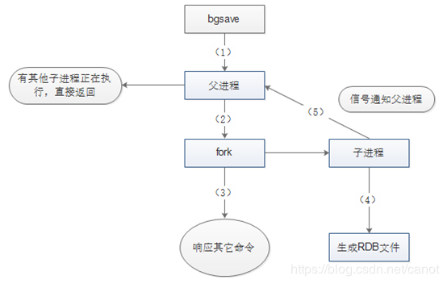

### 自我介绍：

面试官您好，我叫陈俊嘉，就读于中山大学计科专业，科研方向主要是图像信息安全方面，目前已发表论文一篇，还有另一篇在审稿。岗位意向是后台开发，过去1月-3月份里在今日头条的存储架构部门担任实习生一职，在这期间的主要工作是开发快速启动redis集群以及代理的工具，并且在工具开发完成之后，利用这个工具复现修复线上的Bug，自己对redis有较为深入的了解，例如其丰富的数据类型以及持久化机制。对于后台开发这个岗位，我比较熟悉网络编程这一模块，例如一些IO复用组件、TCP、UDP套接字编程，谢谢。

## 腾讯一面，csig（CDN与加速）
*   实习时长、实习时间
*   实习经历一些问题，子文件能否用模板替代（考虑这个问题）
*   谈一谈Redis的持久化
*   用RDB存储会有什么问题
*   写RDB文件在什么情况下会出现大量IO操作
*   Redis写RDB文件的过程具体是如何的
*   Redis在某一台机器上聚集大量热key如何处理
*   谈一谈select、epoll底层实现的不同
*   epoll的ET、LT模式在编程上需要注意什么
*   返回栈的min，时间要求O(1)
*   不用库函数实现sqrt
*   提问环节


## 腾讯二面，csig（CDN与加速）
*   介绍一下自己在今日头条做的技术以及工作
*   遇到技术上最大的挑战
*   虚函数与纯虚函数的不同以及应用（没答好）
*   描述一下二分查找法
*   sqrt(n)在固定精度下如何收敛？
*   提问（关键）


## 腾讯二面准备 (总方向) ，csig（CDN与加速）
*   一面中不懂问题的理清（主要Redis、网络这一块）
*   CDN与加速的了解（稍微深入一些）
*   看csig的后台面经，以往的面经复习
*   最后提问的问题准备
*   看算法解题思路（代码不用敲，外存归并）


## 腾讯二面准备

*   写RDB的主要过程是怎样的？

	

    *   客户发送BGSAVE命令请求
    *   主进程判断当前是否可以允许进行RDB的快照存储
    *   不可以则直接返回，可以则fork()（阻塞）创建子进程后调用rdbsave()
    *   子进程被创建则返回创建成功信息给父进程，父进程则继续处理其他请求
    *   子进程创建临时快照文件成功后，替换原来的RDB文件
    *   子进程返回信息给父进程，父进程更新信息（dirty、lastsave）

*   epoll底层实现机制？epoll的ET、LT模式在编程上需要注意什么？

    ```c++
    int epoll_create(int size)；
    int epoll_ctl(int epfd, int op, int fd, struct epoll_event *event)；
    int epoll_wait(int epfd, struct epoll_event * events, int maxevents, int timeout);
    ```

    ``` C++
    // epoll的核心实现对应于一个epoll描述符
    struct eventpoll {
        ......
        // 已就绪的需要检查的epitem 列表
        struct list_head rdllist;  
        /* 保存所有加入到当前epoll的文件对应的epitem */  
        struct rb_root rbr;  
        ......
    }
    // 对应于一个加入到epoll的条目
    struct epitem {  
        ......
        // 挂载到eventpoll 的红黑树节点  
        struct rb_node rbn;  
        // 挂载到eventpoll.rdllist 的节点  
        struct list_head rdllink;  
        /* 文件描述符信息fd + file, 红黑树的key */  
        struct epoll_filefd ffd;  
        // 当前epitem 的所有者  
        struct eventpoll *ep;
        /* epoll_ctl 传入的用户数据 */  
        struct epoll_event event;
        ......
    };  

    // 文件描述符信息fd + file, 红黑树的key
    struct epoll_filefd {  
        struct file *file;  
        int fd;  
    };  

    // 用户使用的epoll_event  
    struct epoll_event {  
        __u32 events;  
        __u64 data;  
    } EPOLL_PACKED;  

    //上述epoll_event中的events可以是以下几个宏的集合：
    EPOLLIN ：表示对应的文件描述符可以读（包括对端SOCKET正常关闭）；
    EPOLLOUT：表示对应的文件描述符可以写；
    EPOLLPRI：表示对应的文件描述符有紧急的数据可读（这里应该表示有带外数据到来）；
    EPOLLERR：表示对应的文件描述符发生错误；
    EPOLLHUP：表示对应的文件描述符被挂断；
    EPOLLET： 将EPOLL设为边缘触发(Edge Triggered)模式，而水平触发(Level Triggered)是默认缺省值。
    EPOLLONESHOT：只监听一次事件，当监听完这次事件之后，如果还需要继续监听这个socket的话，需要再次把这个socket加入到EPOLL队列里
    ```

    *   epoll高效支持百万级别的句柄监听实则是由最上面提到的三个函数完成的，**epoll_create, epoll_ctl, epoll_wait**，这三个函数底层实现与高效息息相关，下面主要介绍他们的底层实现。
    *   **int epoll_create(int size)** 函数被调用的时候，实则是内核根据传入参数size为eventpoll这个结构体分配合适的内存空间，在这个结构体中包含了两个比较关键的成员，一个是保存每个描述符的红黑树rb_tree（高效地处理epoll_ctl的增删改，查是增之前会查），一个是存储就绪事件的双向链表list。
    *   **int epoll_ctl(int epfd, int op, int fd, struct epoll_event \*event)** 被调用时，根据传入的参数，对epfd对应的eventpoll结构体中的红黑树进行更新。添加fd时，除了会在红黑树中插入新的节点外，还会向内核注册对应于这个fd的回调函数。回调函数作用在于：当事件被触发时，回调函数就会被调用，那么假设当某个描述符的事件被触发，回调函数就可以把这个事件放入到就绪链表list中，等待用户处理。
        *   **epfd**：是epoll_create()的返回值。
        *   **op**：表示op操作，用三个宏来表示：添加EPOLL_CTL_ADD，删除EPOLL_CTL_DEL，修改EPOLL_CTL_MOD。分别添加、删除和修改对fd的监听事件。
        *   **fd**: 是感兴趣的描述符
        *   **epoll_event**： 感兴趣的事件
    *   **int epoll_wait(int epfd, struct epoll_event * events, int maxevents, int timeout)** 被调用时，这时候只需要查看就绪链表list中是否有存在数据，有则根据list中的数据将其复制到传入参数events中并返回，没有则阻塞，当timeout到了则返回。
    *   **ET（边缘触发）模式在epoll_ctl时进行设置的，默认则为LT（水平触发）**，LT水平触发模式下，描述符的事件上若还有未处理的事件时，它会被再次添加到就绪链表list上，等待下一次的epoll_wait调用，因此对于LT模式来说，可以不用对这个事件进行立即处理，或者说不用一次性全部处理完成。而ET边缘触发模式下的描述符，必须要一次性全部处理（若是不一次性全部处理，例如数据必须全部读完或是写完，否则是不会重新放入就绪列表list上），那么在编程的过程中，针对ET模式的描述符，若是recv()返回的大小恰好等于请求的大小，那么这时候可能就会存在还有未读完的数据在缓冲区中，必须重复读取，直至返回的大小小于请求的大小才把这个事件处理结束。ET模式是高效工作模式，不会像LT模式一样，不断地重复触发。

    *   内容分发网络(Content delivery Network, CDN)问题准备：
        

        

        *
        


        *   运营商自己没有CDN加速吗？CDN走运营商的节点与走我们产品的节点区别很大吗？是因为运营商的加速节点覆盖面远不如我们产品的覆盖面大吗还是说我们的一些调度系统更智能？

        *   平时在路边见到的高高的柱子那些是否就是类似于CDN节点这些？

        *   智能调度系统是否会采用一些机器学习或者是深度学习方面的知识去解决问题？

        *   云产品CDN节点的添加与去除是否都需要和运营商交互？智能调度器？

        *   实习生去到一般会做什么工作？研发内部工具吗？会参与到线上的开发吗？一面面试官是做成本方面的，那如果是自己去到了部门的话，是否也会从事相关的工作？
        *   如果就我个人而言，作为正式员工到这个岗位上，您觉得我还需要在哪方面（技术）提升自己才能够满足岗位需求？