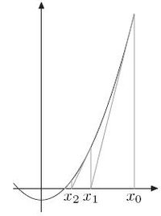

## 算法
---

*   ### **sqrt()的底层实现**
    *   sqrt的实现方式主要由以下两种：二分查找法、牛顿迭代法
        *   二分查找法：利用二分搜索不断缩小搜索范围，开始的范围大小设置为[0, (a/2)+1]，后者保证 ((a/2)+1)^2 > a^2。然后利用二分查找不断缩小范围，最后退出的条件设置为差值小于选定的阈值。
        ```c++
            double mysqrt_binarysearch(double a) {
                if (a <= 0) {
                    return 0;
                }
                double thre = 0.0000000000000000001;
                double begin = 0.0, end = (a / 2) + 1, mid, tmp;

                do {
                    mid = (begin + end) / 2;
                    tmp = pow(mid, 2);
                    if (abs(tmp - a) <= thre) {
                        return mid;
                    } else if (tmp < a) {
                        begin = mid;
                    } else {
                        end = mid;
                    }
                } while (1);

                return mid;
            }
        ```

        *   牛顿迭代法（**更好，更快！！！**）：牛顿迭代法利用 $f(x) = x^2 - a$ 这样的一个函数，实则是求解这个函数在与x轴的交点位置即$x^2 - a = 0$。牛顿法利用切线方程不断逼近最优解$x_{n}$。
        
        *   求导数可以得到切线斜率 => $f^{'}(x) = 2x$, 从图中可以看到先随机选取$x_{0}$，其对应的$f(x_{0})= x_{0}^2 - a$。
            
        *   利用两点$[x_1, 0]$ 与 $[x_0, f(x_{0})]$ 计算切线斜率：
            $$f^{'}(x_{0})=\frac{0-f(x_{0})}{x_{1}-x_{0}}$$
            $$ => 2x_{0}=\frac{0-(x_{0}^2 - a)}{x_{1}-x_{0}}$$
            $$ => x_{1} = \frac{1}{2}(x_{0}+ \frac{a}{x_{0}})$$
            $$ 一般化：x_{n} = \frac{1}{2}(x_{n-1} + \frac{a}{x_{n-1}})$$

        *   因此，每次循环只需根据$x_{n-1}$求出$x_{n}$即可。程序非常简单。

    	    <div align=center>
            
    	    </div>

        ```c++
            double mysqrt_newton(double a) {
                if (a <= 0) {
                    return 0;
                }
                double thre = 0.000000000000000000001;
                double pre = a, next;

                while (1) {
                    next = (pre + a / pre) / 2;
                    if (abs(pre - next) < thre) {
                        return next;
                    }
                    pre = next;
                }
            }
        ```

*   ### **动态规划算法整理**

    -   **背包问题**：$n$ 种物品和一个容量为 $V$ 的背包，第 $i$ 件物品所花费背包容量的大小为 $c[i]$，价值为 $w[i]$。

        -   **01背包**：每个物品最多只能装一个，求最大总价值和。

            -   状态转移方程：$dp[i][j]= max(dp[i-1][j], dp[i-1][j-c[i]] + w[i])$

            -   $dp[i][j]$表示前 $i$ 个物品在容量为 $j$ 的情况下的最大价值总和；前者表示抛弃第 $i$ 个物品，重量不变的最大价值总和；后者则表示放入第 $i$ 个物品，重量恰好为 $j$ 时的最大价值总和。

            -   一般代码形式：
                ``` c++
                // 不节约空间的方式
                for(int i = 1; i <= n; i++) {
                    for(int j = 0; j <= V; j++) {
                        if (j - c[i] >= 0)
                            dp[i][j] = max(dp[i - 1][j], dp[i - 1][j - c[i]] + w[i]);
                        else
                            dp[i][j] = dp[i - 1][j];
                    }
                }

                // 节约空间的方式，因 dp[i][j] 由前面的结果得到，必须从后往前遍历
                for(int i = 1; i <= n; i++) {
                    for(int j = V; j >= 0; j--) {
                        if (j - c[i] >= 0)
                            dp[i][j] = max(dp[j], dp[j - c[i]] + w[i]);
                    }
                }
                ```

        -   **完全背包**：每个物品能装无限多个，求最大总价值和。

            -   状态转移方程：$dp[i][j]= max(dp[i-1][j], dp[i][j-c[i]] + w[i])$

            -   $dp[i][j]$表示前 $i$ 个物品在容量为 $j$ 的情况下的最大价值；前者表示抛弃第 $i$ 个物品，重量不变的最大价值；后者则表示在已考虑了第 $i$ 个物品（已考虑放入第 $i$ 个物品，此时考虑是否继续再放入），重量恰好为 $j$ 时的最大价值。

            -   一般代码形式：
                ``` c++
                // 不节约空间的方式
                for(int i = 1; i <= n; i++) {
                    for(int j = 0; j <= V; j++) {
                        if (j - c[i] >= 0)
                            dp[i][j] = max(dp[i - 1][j], dp[i][j - c[i]] + w[i]);
                        else
                            dp[i][j] = dp[i - 1][j];
                    }
                }

                // 节约空间的方式，因 dp[i][j] 需要由更新后的 dp[i][j - c[i]] 得到，因此无需从后往前遍历，遍历方向还是依旧一样
                for(int i = 1; i <= n; i++) {
                     for(int j = 0; j <= V; j++) {
                        if (j - c[i] >= 0)
                            dp[i][j] = max(dp[j], dp[j - c[i]] + w[i]);
                    }
                }
                ```

        -   **多重背包**：每个物品最多能装入 $n[i]$ 个，求最大总价值和。
            -   状态转移方程：$dp[i][j]= max{\{dp[i-1][j-k \times c[i]] + k \times w[i] | 0 <= k <= n[i]}\}$

            -   $dp[i][j]$表示前 $i$ 个物品在容量为 $j$ 的情况下的最大价值；$0 <= k <= n[i]$表示可以放入 $0$ 到$n[i]$ 个进背包中，最大的价值和作为结果。

            -   一般代码形式：
                ``` c++
                // 节约空间的方式，从后往前遍历
                for(int i = 1; i <= n; i++) {
                    for(int j = V; j >= 0; j--) {
                        for(int k = 0; k <= n[i]; k++){
                            int maxVal = -INT_MAX;
                            if (j - k * c[i] >= 0)
                                maxVal = max(dp[j - k *c[i]] + k * w[i], maxVal);
                            else
                                break;
                        }
                        dp[j] = maxVal;
                    }
                }
                ```

        -   **二维费用背包**：在01背包条件下，多增加一个约束性条件，例如背包不再仅仅是容量约束，而是最大质量负荷 $M$ 以及最大空间负荷 $S$ 两个约束，在给出每个物品的质量 $m[i]$，空间占用 $s[i]$，求背包最大价值总和。

            -   状态转移方程：$dp[i][j][k]= max(dp[i-1][j][k], dp[i-1][j-m[i]][k-s[i]]+w[i])$

            -   $dp[i][j][k]$表示前 $i$ 个物品在质量负荷为 $j$ 以及空间负荷为 $k$ 的情况下的最大价值。前者同样是选择不要第 $i$ 个物品，后者则是在两个约束下选择将第 $i$ 个物品放入背包的最大价值。

            -   一般代码形式：
                ``` c++
                // 节约空间的方式，从后往前
                for(int i = 1; i <= n; i++) {
                    for(int j = M; j >= 0; j--) {
                        for(int k = S; k >= 0; k--) {
                            if (j - m[i] >=0 && k - s[i] >= 0)
                                dp[j][k] = max(dp[j][k], dp[j - m[i]][k - s[i]] + w[i]);
                        }
                    }
                }
                ```

    -   **最长公共子序列（LCS）**：子序列意味着不需要连续，例如 **ABCAD** 与 **DBABAD** 的最长公共子序列为：4（ABAD），给出字符串 $x$ 与字符串 $y$，求其最长公共子序列。

        -   状态转移方程：
            $$ LCS[i][j] = \left\{
            \begin{aligned}
            & 0 ,   & i = 0\; or \;j = 0 \\
            max(LCS[i-1][j], \; & LCS[i][j-1]), & i,j>0 \;and \; x[i] \neq y[j]\\
            LCS[i-1]&[j-1] + 1, & i,j>0 \;and \; x[i] = y[j]
            \end{aligned}
            \right.
            $$

        -   $LCS[i][j]$表示字符串 $x$ 在前 $i$ 个字符与字符串 $y$ 在前 $j$ 个字符的最长公共子序列长度。

        -   一般代码形式：
            ``` c++
            // 可以在字符串前加个空格，例如 x = ' ' + x; y = ' ' + y;
            for(int i = 1; i <= n; i++) {
                for(int j = 1; j <= n; j++) {
                    if (x[i] == y[j])
                        LCS[i][j] = LCS[i-1][j-1] + 1;
                    else
                        LCS[i][j] = max(LCS[i-1][j], LCS[i][j-1]);
                }
            }
            ```

    -   **矩阵连乘**：每一种矩阵乘法划分方式将导致不同的计算量，矩阵连乘动态规划则希望求解一种划分方式使得计算量最低。

        -   状态转移方程：
            $$ m[i][j] = \left\{
            \begin{aligned}
            & 0 ,   & i = j \\
            min\{m[i][k] + m[k+1][j] + &p_{i-1}p_{k}p_{j} \;| \; i \leq k \leq j - 1\}, & i < j
            \end{aligned}
            \right.
            $$
        -   $m[i][j]$表示矩阵从第 $i$ 个位置到第 $j$ 个位置的最低计算量，而第 $i$ 个位置到第 $j$ 个位置之间肯定有第 $k$ 个位置是最优的左右分割方法，将其找出即可。
