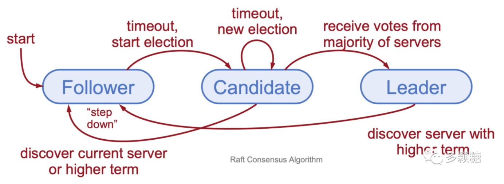

### Raft
---

*   ### **数据库中的Raft是什么**
    -   Raft是一种分布式一致性算法，用来保证分布式系统中所有节点的数据日志是一致的
---

*   ### **Raft的简易流程**
    

    
    

    -   选举：
        -   所有的节点状态只有三种：Leader、Follower、Candidate
        -   所有节点通过领导选举的方式来决策出Leader，一开始所有节点都是Follower，任意的节点都可以成为Leader
        -   开始新一轮选举时，Term（周期）+1，Term只会递增，不会递减（必须持久化Term）
        -   只有获得多数派节点的投票才能够被选举为Leader
        -   一个分布式系统只能有一个Leader，Leader需要通过心跳发送维持自己的地位
        -   一旦某个节点发现Leader心跳缺失，就可以尝试新的一轮选举
    -   日志复制：
        -   Leader负责接收客户端的请求，将请求追加到自己的本地日志中
        -   负责将新的日志广播给系统中的所有其余节点
        -   当大多数节点都复制了这个日志条目，Leader将其提交并应用到状态机中
---

*   ### **如何解决Raft的Split Vote问题**
    -   Split Vote的意思是每一轮Term中有多个节点并发地共同发起选举导致了分票，这样会导致没有任何节点能够成为Leader，因为没有办法获得大多数选票
    -   每个节点发起投票的时间是随机的，随机超时，但超时到达时才能够发起投票，这样就避免了Split Vote问题
    -   节点发起投票时就会由Follower转为Candidate，最后只有一个节点成为Leader
---

*   ### **Raft的两个RPC是什么**
    

    
    

    -   RequestVote RPC（用于投票，是发生在选举阶段的RPC），具体流程如下：
        -   Candidate向所有节点发送RequestVote PRC索要投票，请求中包含最新一条日志的Index以及Term，以及自己当前的Term等信息
        -   接收到RequestVote RPC请求的节点先比较Candidate节点新一轮的Term是否比自己当前的要小，若Candidate的Term更小（我的数据更新），则拒绝该请求，否则继续往下处理
        -   节点接着检查是否在新一轮的Term中投过票，若已经投过票，则拒绝该请求，否则继续往下处理
        -   节点接着将自身的最后一条日志条目的索引和任期号与请求中的信息进行比较，若请求中的信息更小（更旧），则拒绝该请求，否则往下处理
        -   节点将自身的投票状态转移为该Candidate，并将投票的状态持久化，避免在一轮的Term中投多次票
        -   节点将自身响应状态发送回给Candidate，包括自己最新一条日志的index与Term，以及一个成功的标志告知投票成功

    -   AppendEntries RPC（用于日志复制、心跳发送，是发生在选举阶段结束后的RPC），具体流程如下：
        -   Leader向所有的Follower发送AppendEntries RPC追加日志，请求中包含了最新一条日志的Index+Term以及上一条日志的Index+Term，以及自己当前的Term等信息
        -   接收到AppendEntries RPC的Follower先检查自己的Term是否比请求中的Term要还要大，若更大则拒绝该请求，否则继续往下处理
        -   Follower接着检查自己保存的日志条目和请求中上一条日志条目的Index+Term是否能够匹配的上，若无法匹配，则拒绝该请求，否则继续往下处理
        -   Follower删除请求中的上一条日志条目的Index+Term之后的所有不匹配的日志，然后将请求中的最新一条日志的Index+Term追加到自己的日志中（清理与复原日志）
        -   Follower节点最后将自身的响应返回给Leader节点，包括自身节点当前的最新的Index+Term和一个成功的标志。
---

*   ### **Mongodb对Raft协议的优化和改进**
    -   增强Leader选举过程。心跳检测节点的存活性是异步线程去完成的，加快了选举的过程。
    -   改进了复制的流程。Leader收到客户端请求会先将日志写入本地，再异步复制给其他的节点，提供系统的写入和吞吐。
    -   增加了读的可取性。支持在Follower节点上进行读取操作，这样可以减轻Leader节点的压力，提高读取的可用性和性能。
    -   增强了节点恢复流程。当一个节点宕机一段时间后，重新加入集群时，可以以增量复制的方式快速恢复到最新的状态，减少了节点的恢复时间。
    -   支持Arbiter等更多的角色。增强了集群的容错率以及可用性。

---