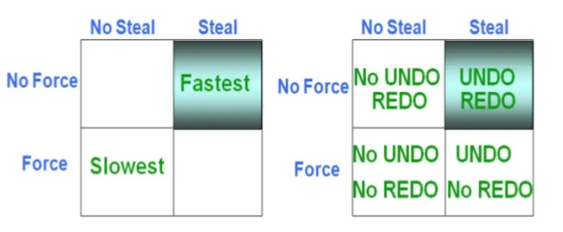

### Crash Recovery（故障恢复）
---

*   ### **数据库中的Force和Steal是什么**
    -   Steal/No Steal：是否允许一个未提交的事务（Uncommitted）提前刷盘，Steal代表允许，No Steal代表不允许
    -   Force/No Force：已提交的事务（Committed）是否必须立即刷盘，Force代表必须，No Force代表不必须
    
    

    
    

    -   UndoLog Only：
        -   典型数据库：?
        -   Steal + Force
        -   落盘顺序：Log日志 -> Data -> commit日志

    -   RedoLog Only：
        -   典型数据库：MongoDB
        -   No Steal + No Force
        -   落盘顺序：Log日志 -> commit日志 -> Data

    -   Undo + Redo Log：
        -   典型数据库：MySQL
        -   Steal + No Force
        -   落盘顺序：RedoLog + UndoLog 优先于 commit日志 + Data，commit日志和Data无须约束刷盘顺序
    
    -   记忆：
        -   未提交的事务如果能刷盘，并剔除出内存，那么在故障时，必然需要UndoLog回滚事务产生的更新。
        -   已提交的事务不刷盘，滞留在内存中，那么在故障时，必然需要RedoLog重做事务保证提交的事务数据不会丢失

--- 

*   ### **数据库中Steal和No Steal的模式会带来什么不同的利弊**
    -   Steal模式下，由于未提交的事务可以任意刷盘，因此内存中的数据能够被及时逐出，相对于No Steal模式，存储引擎的内存占用量更小，并且高负载场景下不会频繁发生Page的淘汰
    -   Steal模式下，必须有UndoLog来保证未提交的事务在故障时被回滚，因此故障恢复的时间对比No Steal要更长，因为在故障恢复期间需要判断UndoLog中的事务是否需要被回滚
    -   Steal模式下，由于并不需要顾及是否必须在某个时刻执行刷盘，因此可以将产生的更新先写入缓存中，等待缓存满或者到达一定时间后再将缓存中的数据写入磁盘，可以提高磁盘的写入效率，从而提高写入性能
---

*   ### **数据库中Force和No Force的模式会带来什么不同的利弊**
    -   Force模式下，由于事务提交就立马刷盘，内存中的数据能够被及时逐出，相对于No Force模式，存储引擎的内存占用量更小，并且在高负载场景下不会频繁发生Page的淘汰
    -   Force模式下，由于事务提交就刷盘，因此不需要RedoLog，对比于No Force模式，故障恢复的时间会更短，因为在故障恢复期间无需判断RedoLog里提交的事务是否需要被重做
    -   Force模式下，提交的事务必须立即刷盘，在事务非常多的情况下，会产生大量的磁盘IO，对比于No Force模式，写入性能更差
---

*   ### **在一个事务里，MySQL先写了RedoLog，还未写UndoLog，此时MySQL发生宕机，这时事务还没提交，在故障恢复时缺少了UndoLog，没办法回滚事务，那怎么办？**
    MyAnswer:
    -   从日志中寻找是否有commit日志
        -   无Commit日志，直接越过这个RedoLog，因为数据压根没有刷盘，可以直接忽略，无需重做或回滚
        -   有Commit日志，则必然存在UndoLog，因为commit日志一定是在undoLog写完之后再写入

    ChatGPT:
    -   实际上，MySQL 会采用一些机制来解决这种情况。在 MySQL 中，如果事务在崩溃之前只写了 RedoLog，那么 MySQL 在恢复时会按照以下步骤进行：
        -   从 RedoLog 中恢复数据，将已提交的事务的更改应用到数据库中。
        -   将已提交的事务标记为已提交。
        -   在内存中重建未提交的事务的状态。
        -   从内存中恢复未提交的事务的更改。
        -   将未提交的事务回滚。

    -   在这种情况下，MySQL 会根据 RedoLog 的内容重建数据，但由于缺少 UndoLog，MySQL 无法恢复未提交的事务的状态。为了解决这个问题，MySQL 会将未提交的事务标记为“未完成的事务”，并在内存中重建它们的状态。然后，MySQL 会从内存中恢复未提交的事务的更改，并将它们回滚。这个过程被称为“反向回滚”。

    -   因此，即使 MySQL 先写了 RedoLog 而没有写 UndoLog，也不会导致数据丢失。不过，在这种情况下，MySQL 在恢复时需要进行反向回滚，这可能会导致一些性能损失。
---

*   ### **MySQL为什么是先写RedoLog后写UndoLog**

---

