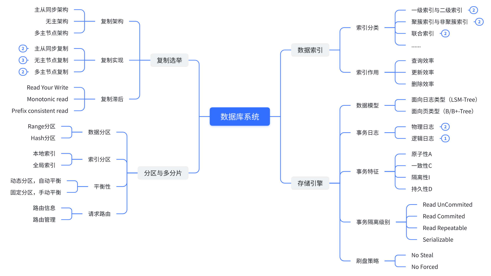
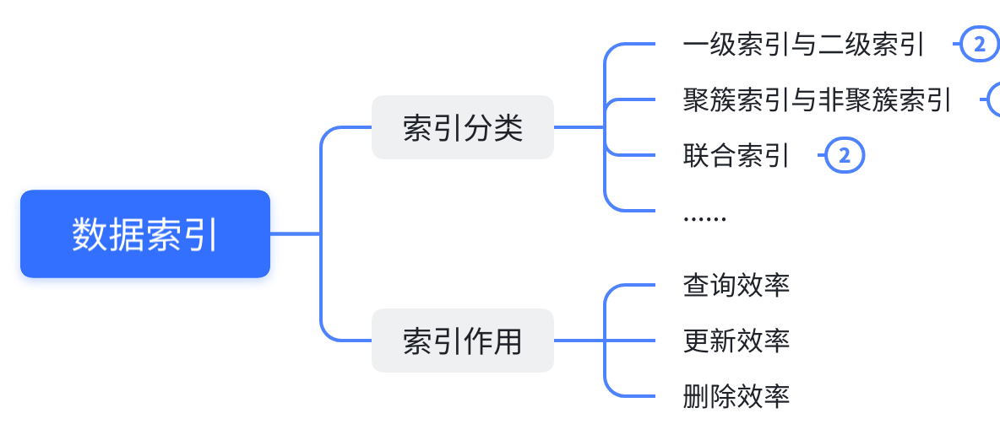
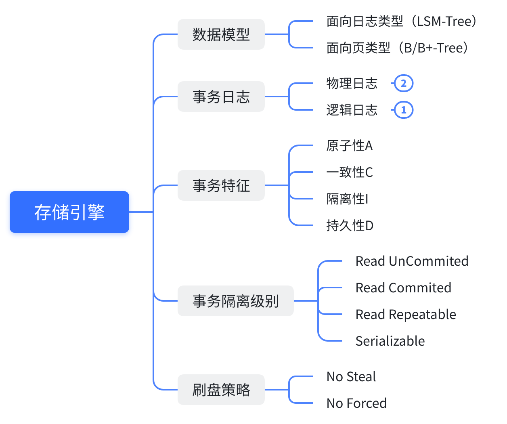
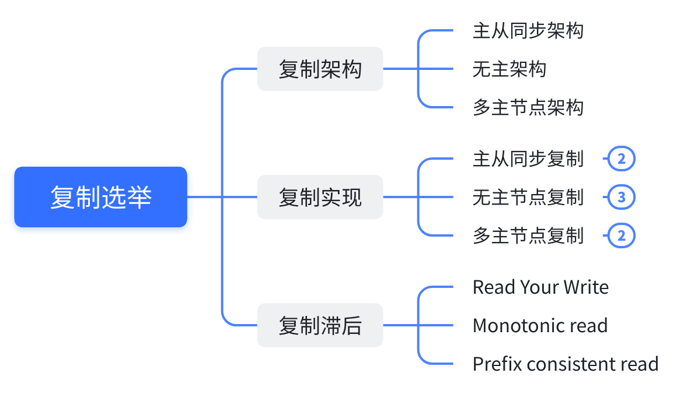
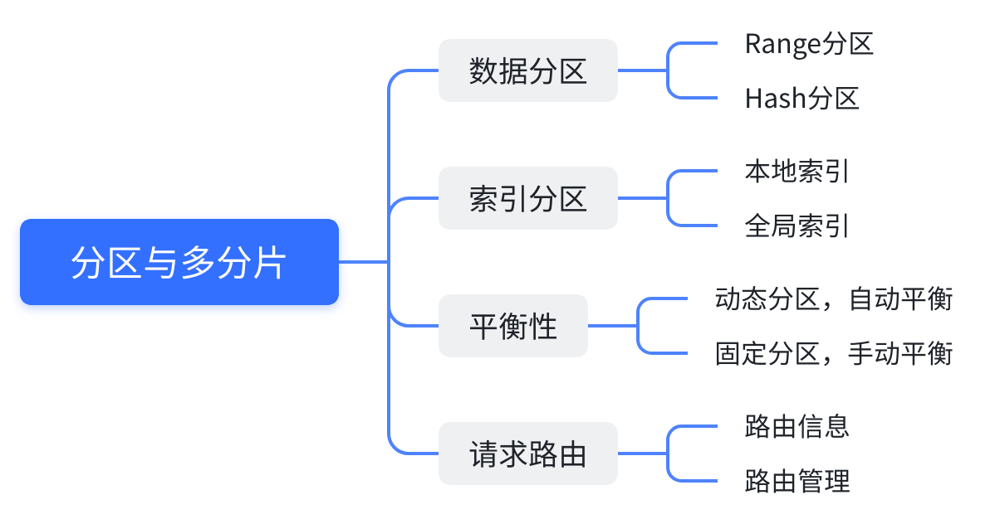

# 你不能不了解的数据库系统知识

## 写在开头
> &emsp; 大家好，我系乜都识一D嘅鬼仔。作为一名常年混迹于互联网的算法与研发搬砖工程师，在平时写代码的时候是根本没办法避免和数据打交道，并且鬼仔还记得当时面试BAT、TMD等各种大厂面试的时候，与数据库相关问题层出不穷。其中呢，更多就是数据库相关的各种问题，比如：
> - 你了解联合索引吗？什么是最左前缀匹配原则？
> - 你了解主从同步架构吗？有什么复制实现算法？Raft了解吗？
> - 你了解事务ACID吗？ACID有什么用？
> - 你了解事务的隔离级别吗？它们的作用是什么？
> - ......
> 
> 诸如此类，与数据和数据库相关的技术问题，今天鬼仔就给大家带来数据库系统知识的通用科普篇。之后，鬼仔也会陆陆续续给大家整理一些更为详细数据库系统知识，与我们本次的科普篇是非常相关的。如果大家对数据库还有什么感兴趣的知识点，也非常欢迎大家后台私聊鬼仔。鬼仔看到后，除了**知无不言**，还是**知无不言**。
> 
> 好了，废话不多说，下面开始学！习！（敲黑板！记笔记！重点来了！）

## 数据库系统
&emsp; 数据库是一个非常庞大且复杂的系统，它是按照**数据结构**来组织、存储和管理数据的仓库。是一个长期存储在计算机内的、有组织的、可共享的、统一管理的大量数据的集合。可想而知，对这么一个庞大的系统，想要一下子搞懂里面的所有基本原理与实现细节是基本不可能的。正所谓，饭要一口一口地吃，路要一步一步地走。学习其实就像走路一样，你如果不Step By Step，是很难走到终点的。

&emsp; 基于此，我们需要对数据库系统整体有一个感知，并且循序渐进地了解系统里的每一个组成模块，进而才能够把握整个系统的运作原理。以下我整理了数据库系统的一些基本知识点，这里涵盖了大部分知识点，但不意味是整个数据库系统的构成，**后续鬼仔仍然会继续持续补充或修改**：

&emsp; 首先我们将整体系统分为4个子模块：
- 数据索引
- 存储引擎
- 复制与选举
- 分区与多分片

可能有很多人会问鬼仔为什么要分成这4个模块？其实对于数据库系统的知识切分，鬼仔也有深思熟虑过，最终决定这样的切分方式是基于一个非常重要原因：**相关知识更易被理解、被吸收**。

&emsp; 换个方式讲，如果鬼仔一上来就给大家介绍数据库**查询计划、执行引擎、分布式事务**等这类过于深入的知识点，那么势必会造成物极必反的缺陷。在分享数据库系统知识的时候，鬼仔会从用户使用到子模块的运作慢慢地深入分享。在下文，鬼仔会粗略地给大家分享4个子模块构成以及它的基本含义，在之后，会有更详细更细致的干货等着大家，敬请期待吧！

### 数据索引

&emsp; 在关系型数据库中，索引是一种**单独的**、**物理的**对数据库表中**一列或多列**的键值进行**排序**的一种存储结构。它能够帮助用户高效地查询数据库中特定键的值，由于其独立性，数据库对索引的添加或删除都不会直接影响到数据库的数据内容，它只会影响用户的查询性能。引入索引带来的开销则在于每次写入必须同步地更新索引的内容，因此并不是索引数量越多越好，而是适当且正确的索引才能带来最高的收益。

&emsp; 索引的分类可以非常的多。例如，可以将一个索引分为一级索引与二级索引，区别在于它们是否能够从直接从索引表中获取数据，而不需要额外地通过回表的方式去获取数据。也可以将一个索引分为聚簇索引和非聚簇索引，区别则在于数据在索引表里是否与搜索键的顺序保持一致。也可以将一个索引分为联合索引和非联合索引，以及其他的一些定义。有效的索引对查询、更新、删除能够带来非常大的收益，但过多的索引却会降低数据写入的性能。

### 存储引擎

&emsp; 存储引擎是一个数据库系统中最重要的一个模块，它可以被分为两个大类，即**面向日志类型**与**面向页类型**的两个存储引擎大家族，前者的数据模型是**LSM-Tree**，后者的数据模型是**B/B+Tree**，基本业界较为出名的关系型数据库（MySQL、PostgreSQL、MongoDB）与NoSQL数据库（LevelDB、RocksDB、Cassandra、Hbase、Redis）都是基于这两类存储引擎的。

&emsp; 存储引擎提供的事务技术是系统高可靠的强有力保证手段之一。事务将应用程序的多个读、写操作都捆绑在一起成为一个逻辑执行单元。事务中所有读写是一个完整的整体，要么一个事务中所有操作都完成（Commited），要么全都失败（Aborted），这也是事务特征ACID的其中一点。有了事务技术并非就是万能的，每个数据库系统提供的事务都有其相对应的隔离级别，我们必须清楚地了解每种数据库能够提供什么样的隔离级别，对应的隔离级别含义是什么，能够解决什么读写场景，不能解决什么样的读写场景，我们才能够正确地写出可靠、鲁棒的代码。

### 复制选举

&emsp; 数据库节点之间的复制与选举是数据库研究学者这么多年来依然高度关注的课题，由此可知其重要程度堪比存储引擎。那么，复制是什么呢？复制主要指通过网络在**多台机器**上面保存**相同数据**的副本。

&emsp; 为什么是**多台机器**以及**相同数据**？其实并不是说不能在同一台机器上面共同启动多个数据库进程，而是因为在实际生活中，机器故障的概率非常高，就像我们个人电脑一样，经常会遇到死机、系统崩溃等各种各样奇葩的现象，因此如果在同一个机器上面共同启动多个数据库进程，那么数据库的可用性就很难以得到保障了，因此一般线上的服务都会在多个不同机器上面启动数据库进程。同样地，数据是无价的，当数据库提供服务时为了保证数据的准确性、完整性、可靠性，数据一般都会保存成多份，每一份都在不同的机器上，通过数据冗余的方式，能够避免数据丢失这一类严重的事故。除此之外，不同副本之间的数据是完全相同的，因此都能够对外提供数据查询的基本服务，这也拓展了数据库的读能力。

&emsp; 基于上面的解释，可以说复制的真正目的：**提高数据库系统的可用性、提高数据库整体的读吞吐量**。目前据鬼仔了解，业界的复制架构不外乎三种：**主从同步架构、多主节点架构、无主架构**。但它们所对应的复制算法可谓是百花齐放，列在图上的算法肯定是不全的，但鬼仔敢打包票说它们绝对是非常经典的，例如Paxos、Raft、LWW、CRDT等，这一类算法都非常值得大家去学习与探讨。数据库复制带来的好处是显而易见的，但是它同样也会带来别的问题：复制滞后。我们只有深入了解复制后，才能够了解复制滞后会带来什么样的问题，从而在实现应用时准确地规避这类问题。

### 分区与多分片

&emsp; 数据库复制是在不同的节点上保存相同数据的多个副本。然后，在面对**海量数据**的时候或者是**非常高的查询压力**时，单单是复制技术是不足够的，此时数据分区就能够起非常重要的作用，它能够将海量的数据**拆分**，拆分后的每一份数据为单独的一个分区（也叫分片），每一个分区里面可以有多个副本（数据相同）。由于数据被拆分，写入以及查询的流量也会分摊到不同的分区上，从而间接地提高了数据库写入以及查询能力。因此，**采用数据分区时最主要的目的就是提高数据库的拓展能力（读+写）**。

&emsp; 数据分区的方式主要有两种：**哈希分区、区间分区**。当数据执行了分区之后，其对应的索引表也会同样地进行分区，对于不同的索引分区，其分区的方式也有较大的差异。数据在分区后，由于用户数据的个性化、差异化是极有可能导致数据在每个分区的分布产生较大的差异，当差异较为明显时，是有可能导致某些分区的读写流量对比其他分区的要明显的多，这种现象常常被人们称为**数据热点**或**数据倾斜**。如果能够避免这类现象出现，数据平衡是非常关键的技术之一。

## 总结
&emsp; 在本文鬼仔主要给大家从宏观的角度分享整个数据库系统的一些知识，包括数据索引、存储引擎、复制与选举、分区与多分片，大部分子模块分享的比较粗糙，这是因为每一个子模块是无法只用一篇或两篇文章就能够讲清楚的，涉及到一些细节方面的分享，鬼仔都会在后面【数据库】专题系列里面进行一一地分享。鬼仔的目的也很简单，就是希望一篇文章能够将一个知识点讲透、讲深，也希望读者能从鬼仔的文章中有所收获。

#数据库 #存储 #存储引擎 #索引 #复制 #分区 #database #Mysql #Nosql
