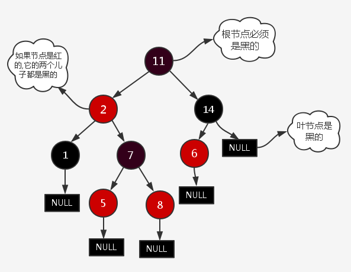

# 数据结构
---
## 二叉树
二叉树查找的性质，花费时间O(logn)：

*   若任意节点的左子树不空，则左子树上所有结点的值均小于它的根结点的值；
*   任意节点的右子树不空，则右子树上所有结点的值均大于它的根结点的值；  
*   任意节点的左、右子树也分别为二叉查找树。  
*   没有键值相等的节点（no duplicate nodes）。  
*   实则等同于二分查找法，左边小于中间小于右边，类似于排序后数组

## 满二叉树
国内定义：一个二叉树，如果每一个层的结点数都达到最大值，则这个二叉树就是满二叉树。也就是说，如果一个二叉树的层数为K，且结点总数是(2^k) -1 ，则它就是满二叉树。

*   从数学上看，满二叉树的各个层的结点数形成一个首项为1，公比为2的等比数列。
*   一个层数为k的满二叉树总结点数为：2^k-1。因此满二叉树的结点树一定是奇数。
*   第k层上的结点数为2^(k-1)
   
国外定义：满二叉树的结点要么是叶子结点，度为0，要么是度为2的结点，不存在度为1的结点即可。

## 完全二叉树
对于深度为K的，有n个结点的二叉树，当且仅当其每一个结点都与深度为K的满二叉树中编号从1至n的结点一一对应时称之为完全二叉树。  
若设二叉树的深度为k，除第 k 层外，其它各层 (1～k-1) 的结点数都达到最大个数，第 k 层所有的结点都连续集中在最左边，这就是完全二叉树。   

*   叶子结点只会出现在最下两层
*   最下层的叶子结点集中在左部连续区域
*   倒数第二层有叶子结点，集中在右部连续区域
*   若结点度为1，则只有左孩子

## AVL树
AVL树是最先发明的自平衡二叉查找树，在AVL树中的任何节点的两个子树的高度最大差别为1，所以它也被称为高度平衡树。查找、插入和删除在平均和最坏情况下的时间复杂度都是O(logn)。节点的平衡因子是它的左子树的高度减去它的右子树的高度（有时相反）。带有平衡因子1、0或 -1的节点被认为是平衡的。(注意节点的高度和深度定义不同)

平衡树的插入以及删除会破坏平衡，需要通过旋转操作重新平衡树：

*   数据结构与算法分析 P83， 对插入、build平衡树的过程详细描述，其中涉及单旋转，双旋转
*   https://zh.wikipedia.org/wiki/AVL%E6%A0%91

## 伸展树
伸展树的基本想法是：当一个节点被访问后，它就要经过一系列的AVL树的旋转被放到根节点上。被查频率高的那些条目就应当经常处于靠近树根的位置， 在每次查找之后对树进行调整，把被查找的条目搬移到离树根近一些的地方。

优点：伸展树的自我平衡使其拥有良好的性能，因为频繁访问的节点会被移动到更靠近根节点，进而获得更快的访问速度。

*   可靠的性能——它的平均效率不输于其他平衡树。
*   存储所需的内存少——伸展树无需记录额外的什么值来维护树的信息，相对于其他平衡树，内存占用要小。

缺点：伸展树最显著的缺点是它有可能会变成一条链。这使得伸展树在多线程环境(不合适)下会变得很复杂。具体而言，如果允许多个线程同时执行查找操作，则需要额外的维护和操作。

## B树
一种自平衡的树，能够保持数据有序。这种数据结构能够让查找数据、顺序访问、插入数据及删除的动作，都在对数时间内完成。

https://pic4.zhimg.com/80/v2-2c2264cc1c6c603dfeca4f84a2575901_hd.jpg

*   树的根或者是一片树叶，或者其儿子数在2和M之间
*   除根外，所有非树叶节点的儿子在[M/2]到M之间
*   所有的树叶都在相同的深度上，所有数据都在树叶上
*   每个内部节点(不包括树叶)应该将左子树和右子树分开，左子树所有值<节点<右子树所有的值
*   所有节点关键字是按递增次序排列

B树相对于平衡二叉树的不同是，每个节点包含的关键字增多了，特别是在B树应用到数据库中的时候，数据库充分利用了磁盘块的原理（磁盘数据存储是采用块的形式存储的，每个块的大小为4K，每次IO进行数据读取时，同一个磁盘块的数据可以一次性读取出来）把节点大小限制和充分使用在磁盘快大小范围；把树的节点关键字增多后树的层级比原来的二叉树少了，减少数据查找的次数和复杂度;
    
## B+树
B+树是B树的一个升级版，相对于B树来说B+树更充分的利用了节点的空间，让查询速度更加稳定，其速度完全接近于二分法查找。

https://pic1.zhimg.com/80/v2-826dac98d666a26b0ffee8cb2ea15a91_hd.jpg

*   B+跟B树不同B+树的非叶子节点不保存关键字记录的指针，这样使得B+树每个节点所能保存的关键字大大增加；
*   B+树叶子节点保存了父节点的所有关键字和关键字记录的指针，每个叶子节点的关键字从小到大链接；
*   B+树的根节点关键字数量和其子节点个数相等;
*   B+的非叶子节点只进行数据索引，不会存实际的关键字记录的指针，所有数据地址必须要到叶子节点才能获取到，所以每次数据查询的次数都一样；

在B树的基础上每个节点存储的关键字数更多，树的层级更少所以查询数据更快，所有指关键字指针都存在叶子节点，所以每次查找的次数都相同所以查询速度更稳定。

## **红黑树、B+树、B树的区别**

-   B+树与B树区别：
    -   B+树是B树的升级版，B树在每一个节点都有索引及指向数据的指针，而B+树只会在叶子节点上保存指向数据的指针，因此B+树叶子节点是包含了所有的索引的。
    -   B+树对磁盘友好：
        -   内部节点不含指向数据的指针，节省了一定的磁盘占用，使得内部索引尽可能在一个块内存储。
        -   查询效率稳定，所有索引最终指向叶子节点，查询必须经过根到叶子的路径。
        -   B+树的遍历可以利用叶子节点间链表串联的方式遍历，而B树就必须利用中序遍历了（往返顺序查找等）。
&emsp;

-   红黑树性质：
    -   节点是黑色或者红色
    -   根节点是黑色的
    -   所有叶子节点是黑色的（叶子节点是null节点）
    -   从根节点到叶子节点的路径上黑色节点数量必须是相同的
    -   若父节点是红色的，则其两个子节点必须是黑色的
-   红黑树弱平衡保证了插入删除查询最坏操作都是O(logN):
    -   因为一条路径上（根到叶子）的黑色节点数量必须相同，那么最短的路径则有可能是全部为黑色，最长的则可能是红色连续交替，这些性质保证了其最长路径不会超过最短路径的2倍，保证了logn的分叉。

<!-- <meta http-equiv="refresh" content="1"> -->
