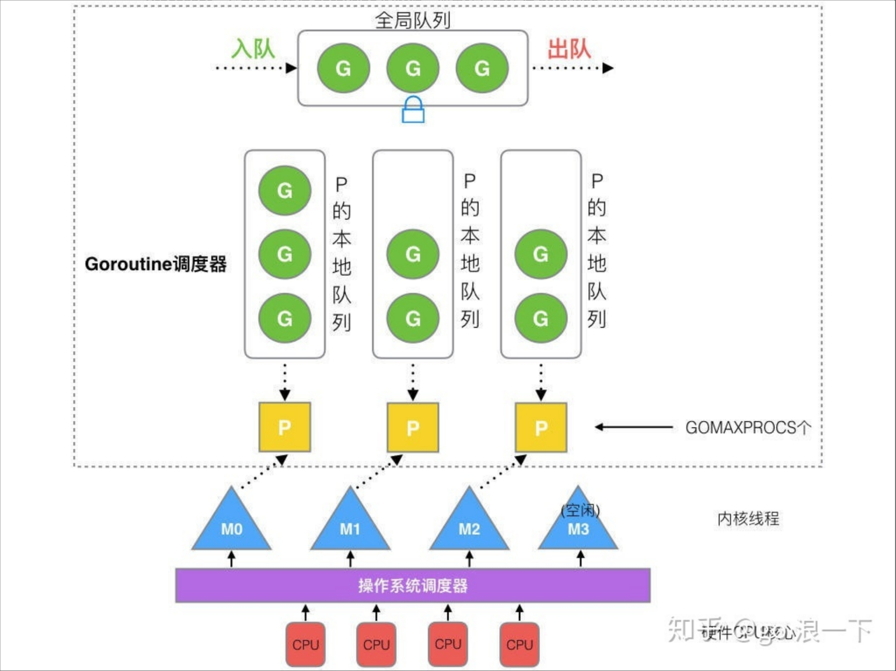
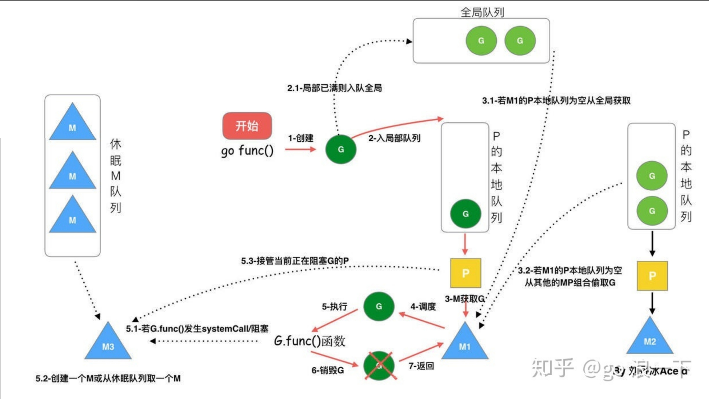

## Go语言
---

-   ### 线程调度器 GMP 机制与原理
    

        
    

    
    #### 模型分析
    -   **G（Goroutine）**：存在于两个主要的队列，一个是Processor本身拥有的本地队列，另外一个是全局队列（Global Queue）
        -   本地队列有约束，最多不能超过256个，超过则会添加到全局队列里面去
        -   全局队列默认无约束，是以前老调度器遗留下来的兜底逻辑，已经被弱化了
    -   **M（Machine）**：每个 M 都代表了 1 个内核线程，OS 调度器负责把内核线程分配到 CPU 的核上执行，这部分交给操作系统去运作，并不做干扰
        -   M 与 P 的数量没有绝对关系，当队列中有很多就绪任务时，优先寻找空闲的M，如果没有空闲的M，就会创建M，因此即使 P 的**默认数量**是 1，也有可能会创建很多个 M 出来
    -   **P（Processor）**：一种逻辑队列，专门用于存放各个goroutine的地方
        -   个数由环境变量 $GOMAXPROCS 或者是由 runtime 的方法 GOMAXPROCS() 决定
        -   在程序启动时就会数量全部创建出来，创建goroutine就会优先放在这些本地队列里面去

    #### 调度设计策略
    -   线程复用
        -   work stealing 机制：当Machine（线程）绑定的Processor上没有Goroutine时，会尝试从其他Processor的队列中偷取Goroutine，如果其他的Processor也都没有Goroutine，则尝试从全局队列里面偷取
        -   hand off 机制：当Machine（线程）绑定上面的Goroutine产生了系统调用（耗时较长），Machine（线程）会主动释放Processor，让出给其余的Machine（线程）去绑定并调度，而当前的Machine（线程）则会继续继续等待系统调用的完成
    -   并行：
        -   最多有GOMAXPROCS个P在同时运行，可以约束最大并行的数量，更好地利用CPU资源
    -   抢占：
        -   与一般的用户态协程（Coroutine）不一样，Goroutine只能最多占据CPU 10ms的时间，一旦时间到达，必须让出CPU，否则有可能其余的Goroutine会被饿死，Goroutine是允许抢占式调度的，这就是 Goroutine 不同于 Coroutine 的一个地方。

    #### go func() 调度流程
    

        
    

    -   go func () 创建一个 Goroutine
    -   优先保存在Processor的本地队列，满了就会放到全局队列
    -   Goroutine 只能运行在 Machine（线程） 中，一个 Machine（线程）运行前必须先持有一个 Processor，M 与 P 是 1：1 的关系
    -   Machine（线程） 会从 Processor 的本地队列弹出一个可执行状态的 Goroutine 来执行，如果 Processor 的本地队列为空，就会想其他的 Processor 偷取一个可执行的 G 来执行
    -   Machine（线程）执行某一个 Goroutine 时候如果发生了 syscall 或则其余阻塞操作，Machine（线程） 会阻塞
    -   如果当前有一些 Goroutine 就绪待执行，runtime 会把这个Machine（线程） 从 Processor 中摘除 (detach)，释放Processor，然后尝试从空闲Machine（线程）中获取，如果没有空闲的Machine（线程）则创建一个
---

-   ### GC（垃圾回收） 机制与原理
    #### Ref
    -   https://zhuanlan.zhihu.com/p/334999060
    -   https://xishng.top/2022/09/08/base_knowlage/gc/golang_gc_develop/
    #### 标记清除法（Go V1.3之前）
    -   大致流程：
        -   暂停所有的运作的协程、线程（Stop The World, STW）
        -   从根对象开始执行标记，找出所有的可达对象，做上标记
        -   清理所有不可达的对象
        -   恢复所有运作的协程，重复以上过程
    -   缺点：
        -   STW时间过长，直接影响到使用，程序经常性卡顿，无法接受

    #### 三色标记法（Go V1.5）
    -   大致流程：
        -   一开始所有新创建的对象都是**白色**对象
        -   从根对象开始扫描，每扫描一轮，转换扫描对象颜色
        -   白色则标记为灰色，灰色则标记为黑色
        -   一直重复，直到没有任何灰色的对象
        -   回收所有白色的对象
    -   三色标记法在不采用STW保护时这种场景非预期的场景会发生：
        -   **GC期间**，已经扫描的黑色对象可能会引用还未扫描的白色对象
        -   **GC期间**，准备扫描对应的灰色对象，但用户却清理了灰色对象到白色对象间的引用
        以上两个问题会导致GC期间，错误地清理了原本不该清理的对象，导致GC有问题
    -   问题解决：
        -   插入屏障：**GC期间**，插入的新对象如果被黑色引用，必须标记为灰色
        -   删除屏障：**GC期间**，产生了引用的删除，则被引用的对象必须标记为灰色，执行下一轮扫描（存在重复扫描，这也是V1.8解决的问题）

    #### 三色标记法+混合写屏障机制（Go V1.8）
    -   大致流程：
        -   GC开始将**栈上**的对象全部扫描并标记为黑色（之后不再进行第二次重复扫描，无需STW）
        -   **GC期间**，任何在栈上创建的新对象，均为黑色
        -   被删除对象标记为灰色
        -   被添加的对象标记为灰色