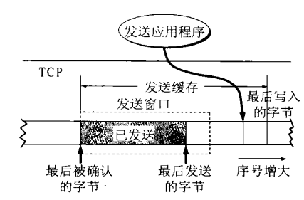

# TCP 可靠传输的依据

*   TCP是一种以全双工方式工作的通信协议，它能够保证通信双方是可靠地通信，确保它可靠地通信除了在建立连接过程中的三次握手以及断开连接四次挥手之外，TCP的可靠性还由窗口滑动机制、缓存机制、超时重传机制、选择确认SACK机制、拥塞控制等来保证其通信是可靠地，下面主要介绍这几种机制。

*   滑动窗口机制

    

    *   TCP传输是以字节为单位进行传输的，现在假设每个数字代表1个字节的数据，图上的所有数字代表为1个字节数据。
    *   TCP是以全双工方式工作，这里简要的介绍A为发送者，B为接收者，这种单向通信的方式在全双工工作也是一样的。
    *   发送者的数据序列有四种状态，依次为：已发送并收到确认、已发送但未收到确认、允许发送但尚未发送、不允许发送。
        * 发送窗口表示：在没有收到B的确认的情况下，可以**连续把窗口内的数据发送出去**。凡是已经发送过的数据，在未收到确认之前都必须暂时保留（上图涂黑部分），以便超时重传使用。
        *   窗口大小由P3-P1决定，P1指针（窗口后沿）始终在收到确认与没有收到确认的边界上，前移的过程则是陆续收到确认的过程。四个部分利用三个指针分割。P2->P3部分有可能是因为**TCP缓冲区**中还没有这些数据，因此还没有发送出去，也有可能是正在发送的过程中。
    *   接收者仅有2个指针标记接收窗口，三种状态分别是：已发送确认并交付主机、允许接收、不允许接收
        *   接收窗口后沿是**已接收到的数据并已发送确认**与允许接收的分界线，窗口前沿是允许接收和不允许接收的分界线。
        *   由图上显然可以看出**未按序到达的字节**并不给予发送ACK而只是对序列号进行一种标记，依旧等待接收窗口后沿的数据到达（例如上图等待着34的到达，却不会发送37，38的ACK），接收者**只对有序的序列号字节数发送ACK**（是否是为了确保发送者指针P1的有序移动？）。
    *   发送者发送窗口的前沿与接受者接收窗口的前沿必须是一致的。

*   缓存机制

    
    *   发送缓冲区大小必定是大于发送者滑动窗口的大小，其主要保存：
        *   涂黑部分为已发送但未收到确认，必须得保存（重传机制）
        *   即将发送部分，但未发送
    *   发送缓冲区的后沿与发送滑动窗口后沿是一致的

    
    *   接收缓冲区大小必定是大于接收者滑动窗口的大小，其主要保存：
        *   已接收也发送了确认(大块涂黑部分)
        *   未按序到达的数据（小块涂黑部分）

*   超时重传机制
    *   TCP每发送一个报文段，就对这个报文段设置一次计时器。只要计时器设置的重传时间到还没有收到确认，就要重传这个报文段。
    *   超时重传时间：
        *   平均往返时延RTT=α ×（旧的RTT）+（1-α）×（新的往返时延样本），1 ≤ α ＜ 1 典型的值为α为7/8（旧RTT权重更大）
        *   超时重传时间必须大于RTT是显然的：RTO = β × RTT, β ＞ 1， 推荐是2，也就是建议超时重传的时间是平均往返时延RTT的两倍
    
*   选择确认SACK
    
    

    *   接收者若收到的报文段无差错，只是未按序号，中间还缺少一些序号的数据，采用选择确认的方法来传送缺少的数据，而不重传已经正确接收到的数据。
    *   接收方就先收下这些数据，但要把这些信息准确的告诉发送方，使发送方不要在重复发送这些已经收到的数据

*   拥塞控制

    

    *   慢开始、拥塞控制 
    *   快重传、快恢复